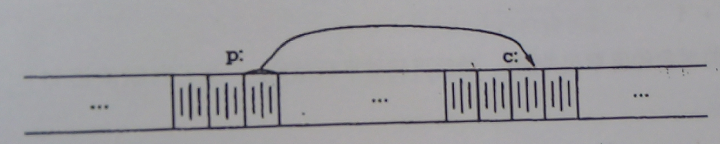

# 指针

**指针是保存变量地址的变量**。实现某些功能必须使用指针。

> 通用指针类型 `void*`

# 指针与地址

内存：机器内一系列连续编号的存储单元。这些存储单元可以单个被操纵，也可以被连续组成的方式操纵。

通常情况下， 机器一个字节存储一个char类型数据，两个相邻直接存储short类型数据。

指针是能够存放一个地址的一组存储单元（通常是2个或4个字节）。

下图c为char类型， p是指向c的指针。



## `&`

`&`符号用于取一个变量的地址，如下列语句：

```c
p = &c;
```

把 c 的地址赋值给变量p，称为**指向**c的指针。

**`&`只能用于内存中的对象（变量与数组元素）**，不能用于产量、表达式等。

## `*`

`*` 表示间接寻址或者间接引用，当它作用于指针时，将访问指针指向的对象。

下例中，假定x、y是整数，ip是指向int类型的指针

```c
int x=1, y=2, z[10];
int *ip; /* ip是指向int类型的指针 */

ip = &x; /* ip 指向x */
y = *ip; /* y的值为1 */
*ip = 0; /* x的值为0 */
ip = &z[0]; /* ip指向z[0] */
```

`int *ip` 表示 *ip 的结果是int类型。

如下代码：

```c
double *dp, atof(char *);
```

`*dp`和`atof(char *)`都是double类型，atof的参数是一个执行char类型的指针。

> **指针只能指向某种特定类型（虽然指向void类型的指针，但它不能间接引用自身）**

## 其他例子

假设ip指向整数类型变量x，可以在x出现的任何上下文中使用*ip

```c
/*将*ip的值加10*/
*ip = *ip + 10;
```

---

```c
y = *ip + 1;
```

`*`和`&`的优先级高于一般的计算运算符。

---

自增操作

```c
*ip += 1;
++*ip;
(*ip)++; /* 括号为必须的，因为++、*这些一元运算符是从右往左计算 */
```

## 指针与变量

指针也是变量，因此可以直接赋值，如果iq是另一个指向整型的指针，那么：

```c
iq = ip; /*iq也指向ip指向的内存部分*/
```

# 指针与函数

函数参数默认是以值传递的，因此不能修改参数的变量值。代码如下：

```c
# include <stdio.h>

void swap(int x, int y) {
    int temp;
    temp = x;
    x = y;
    y = temp;
}

main() {
    int a = 1,b = 2;
    swap(a,b);
    printf("a=%d b=%d", a, b);
    /*a=1 b=2*/
}
```

因为函数参数默认使用了值传递，并不会影响函数外的a，b值，仅仅影响了传入swap()内的a、b的副本。

## 指针参数

要实现交换外部变量需要如下代码：

```c
# include <stdio.h>

void swap(int *x, int *y) {
    int temp;
    temp = *x;
    *x = *y;
    *y = temp;
}

main() {
    int a = 1,b = 2;
    swap(&a,&b);
    printf("a=%d b=%d", a, b);
    /*a=2 b=1*/
}
```

* `swap(&a,&b)`调用函数时传入地址
* `void swap(int *x, int *y)`所有参数声明为指针

