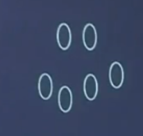
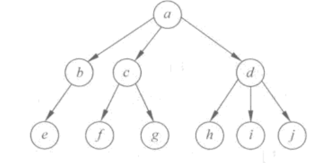
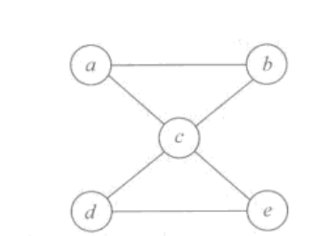

# 基本概念

* *数据：计算中的数字、文字、图片等*
* *数据元素：数据集合中的个体，数据的基本单位。*（**不可分割的最小单位**）

    在程序中通常作为一个整体来进行考虑和处理。
    一个数据元素可由若干个数据项（Dataltem)组成。
*   **数据项是数据的不可分割的最小单位。**
* 数据对象：数据元素的集合
* 数据结构(DataStructure)：是指**相互之间具有（存在）一定联系（关系）的数据元素的集合**。

## 逻辑关系

元素之间的相互联系（关系）称逻辑结构

1. 集合

    

2. 线性结构：结构中的数据元素之间存在一对一关系

    

3. 树型结构

    

4. 图状结构或网状结构：结构中的数据元素之间存在多对多的关系。

    

# 数据结构的存储方式

在计算机内存中的存储方式，如下：

1. 顺序存储结构：用数据元素在存储器中的相对位置来表示数据元素之间的逻辑结构（关系）。
2. 链式存储结构
3. 索引
4. 哈希

# 算法

算法：指令的有限序列

## 算法的特征

1. 输入
2. 输出
3. 有穷性
4. 确定性
5. 有效性/可行性

## 算法度量