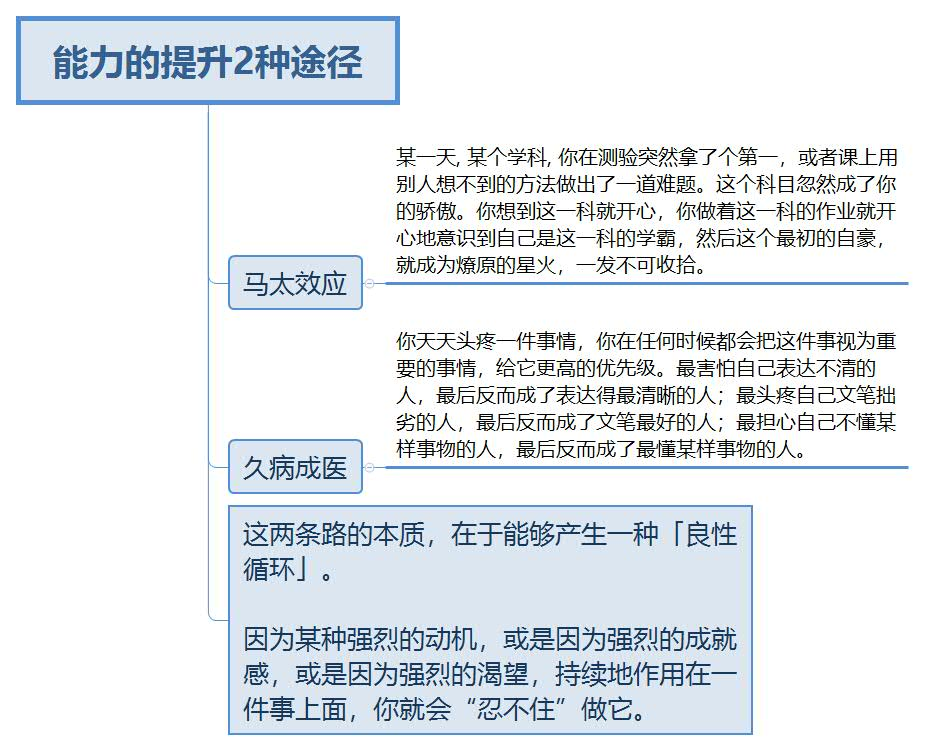
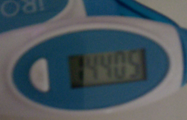
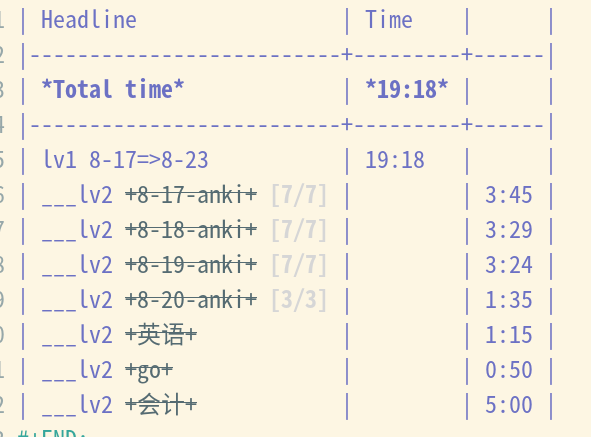
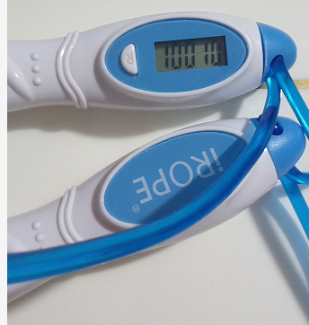
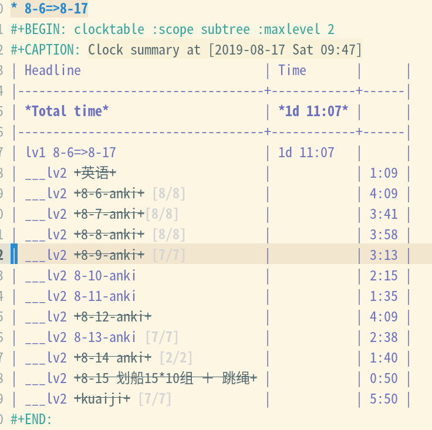
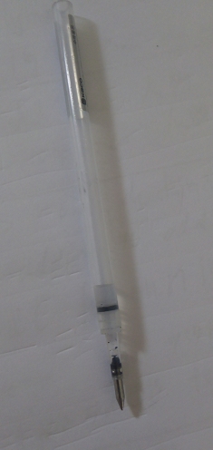

> 好个大王，有身无首

# 2019

---
9-5 0:45

春风又绿江南岸 明月何时照我还

---
8-31 23:53

感觉喜剧之王, 一点也不好看

---
8-31

其实挺扯的.

---
8-29 

跳绳2200, 8月合计18800

---

8-26 18:50

跳绳2200，8月合计14400。

---

8-26 17:14

灾难总是接踵而至， 这正是世间的常理。

---
8-23 23:23

---
8-23

牙疼牙疼

----

8-20

跳绳2200(8月累计 12200).

---

8-18

卧推10组, 跳绳1000(累计10000)

---

8-17

🤦‍

---

8-16 0:14

划船15x10组, 跳绳1000(*累计8000*)

---

8-15 12:44

> **重要和紧急的事哪个一个花费最多的时间?**
>
> "重要的事"
> 只有在重要的事上花费多的时间, 它才不会变成紧急的事来迫害你

---

8-15 12:41

写干了一支笔芯, 👱‍♂️

---

8-14 18:51

颈前推举10组(12x4, 8x5, 10x3), 跳绳1000.

---

8-13 23:51

哑铃12*10组, 跳绳1000. 🍗

---

8-13 23:45

人间不值得

---

8-12

深蹲12*10组, 跳绳1000. 

---
