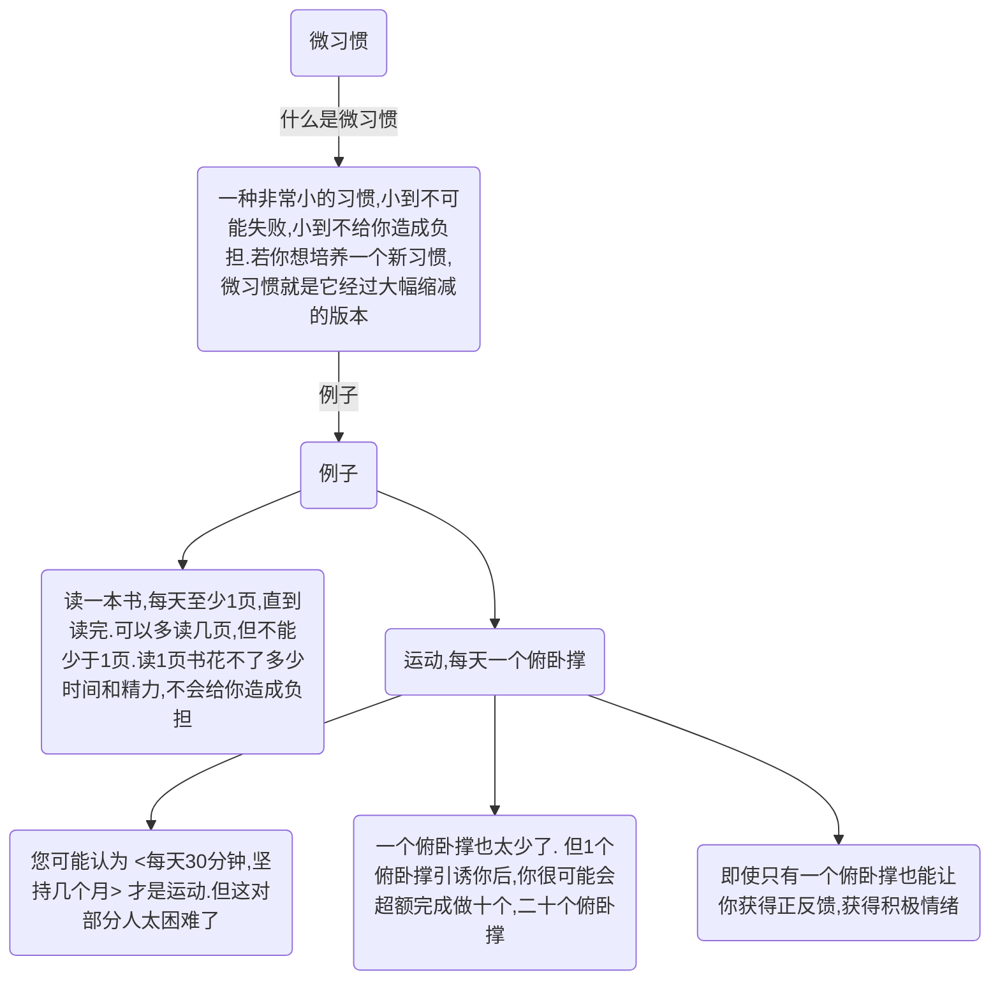

```mermaid
graph TD
    wxg(微习惯)-->|什么是微习惯|js
        js(一种非常小的习惯,小到不可能失败,小到不给你造成负担.若你想培养一个新习惯,微习惯就是它经过大幅缩减的版本)-->|例子|lz
            lz(例子)
                lz-->lz1(读一本书,每天至少1页,直到读完.可以多读几页,但不能少于1页.读1页书花不了多少时间和精力,不会给你造成负担)
                lz-->lz2(运动,每天一个俯卧撑)

                    lz2-->lz2js1(您可能认为 <每天30分钟,坚持几个月> 才是运动.但这对部分人太困难了)
                    lz2-->lz2js2(一个俯卧撑也太少了. 但1个俯卧撑引诱你后,你很可能会超额完成做十个,二十个俯卧撑)
                    lz2-->lz2js3(即使只有一个俯卧撑也能让你获得正反馈,获得积极情绪)
```
