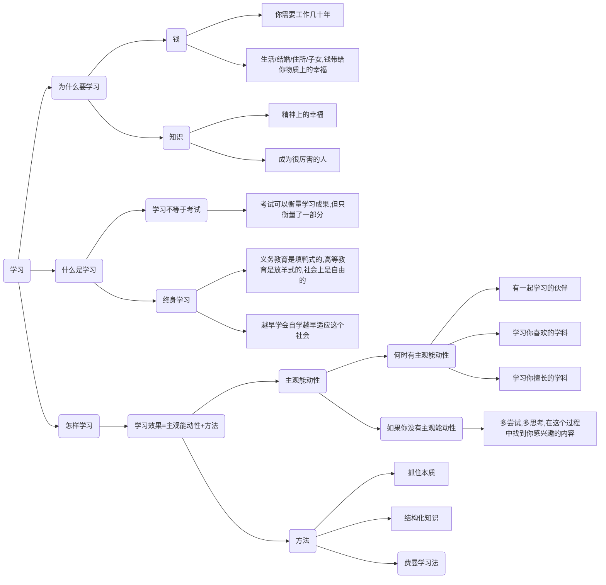

```mermaid
graph LR

sx(学习)-->wsm
    wsm(为什么要学习)-->q
                        q(钱)-->你需要工作几十年
                        q-->生活/结婚/住所/子女,钱带给你物质上的幸福
    wsm-->zs(知识)
            zs-->精神上的幸福
            zs-->成为很厉害的人
sx-->sms(什么是学习)
        sms-->ks(学习不等于考试)
                ks-->考试可以衡量学习成果,但只衡量了一部分
        sms-->zsx(终身学习)
                zsx-->义务教育是填鸭式的,高等教育是放羊式的,社会上是自由的
                zsx-->越早学会自学越早适应这个社会
sx-->zy(怎样学习)
        zy-->xg(学习效果=主观能动性+方法)
                xg-->zgndx(主观能动性)
                        zgndx-->hs(何时有主观能动性)
                                    hs-->有一起学习的伙伴
                                    hs-->学习你喜欢的学科
                                    hs-->学习你擅长的学科
                        zgndx-->my(如果你没有主观能动性)
                                    my-->多尝试,多思考,在这个过程中找到你感兴趣的内容
                xg-->ff(方法)
                    ff-->抓住本质
                    ff-->结构化知识
                    ff-->讨论/教别人(费曼学习法)
```