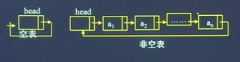

# 链表

## 结构体定义

```c
#include <stdlib.h> /* 引入malloc remalloc 等*/
#include <stdbool.h> /* 引入 true false */
#include <stdio.h>

typedef int ElementType; /* 数据类型 */
typedef struct ListNode {
    ElementType data;   /* 数据 */
    struct ListNode *next; /*下一个链表地址*/
} ListNode, *LinkList; /*LinkList表示头指针*/
```

* 数据由“数据”，“指针”构成，指针指向下一个链表。表尾放一个Null

* 通过c语言提供的标准函数：malloc，realloc，sizeof，free 动态分配链表
    * `p=(*ListNode)malloc(sizeof(ListNode))`
    * `free(p)`释放
* 节点赋值

    ```c
  LNode* p，
  p=(Listnode*)malloc(sizeof(LNode))；
  p—>data=20；
  p—>next=NULL;
    ```

## 创建链表

### 头插法(逆序创建)

从链表表头的第一个位置插入，插入位置与输入位置是相反的。

```c
LinkList CreateList(void) {
    /*创建链表的头结点*/
    LinkList l = (LinkList)malloc(sizeof(ListNode));
    /*或者 ListNode *l = (LinkNode*)malloc(sizeof(ListNode));*/
    l->next = NULL;

    ElementType data; /* 插入的数据 */
    ListNode* node;
    while (true) {
        scanf("%d", &data);
        if (data == -999) { break; } /*接收到-999时停止输入，跳出循环*/
        node = (ListNode*)malloc(sizeof(ListNode));
        node->data = data;

        node->next = l->next;
        l->next = node;
    }

    return l;
}
```

### 尾插法(正序创建)

插入点始终在表尾位置，被插元素总是新的表尾（正序创建）。

```c
LinkList CreateList(void) {
    /*创建链表的头结点*/
    LinkList l = (LinkList)malloc(sizeof(ListNode));
    /*或者 ListNode *l = (LinkNode*)malloc(sizeof(ListNode));*/
    l->next = NULL;

    /*rear 为尾指针,初始化*/
    ListNode *rear, *node;
    rear = l;

    ElementType data; /* 插入的数据 */

    while (true) {
        scanf("%d", &data);
        if (data == -999) { break; } /*接2收到-999时停止输入，跳出循环*/
        node = (ListNode*)malloc(sizeof(ListNode));
        node->data = data;

        /*重点*/
        /*node->next = rear->next;*/ /*即为新节点next插入null 等同于rear->next = NULL*/
        rear->next = node;
        rear = node;
    }
    rear->next = NULL;

    return l;
}
```

### 时间复杂度

无论是头插法还是尾插法，每个节点的复杂度为 $O(1)$ ，总插入时间为 $O(n)$ 。

## 按序号查找

```c
//TODO 此处到底需要指针与否
ElementType GetItem(ListNode *l, int index) {
    int i = 1; /*索引计数*/
    ListNode *node = l->next; /*指向第一个节点*/

    while ((node != NULL) && (i < index)) {
        node = node->next;
        i++;
    }
    /* node=null时 i !=index */
    if (i != index) { 
    /*if (node != NULL) {*/
        return -999;/*error code*/ 
    } else {
        return node->data;
    }
}
```

* 无投资中头节点时 `ListNode *node = l`，`int i=0`
* 链表查找数据需要从头到开始获取，因此时间复杂度为 $O(n)$ 。

## 按值查找

```c
ListNode* LocateItem(ListNode* l, ElementType key) {
    ListNode* node = l->next;
    while ((node != NULL) && (node->data != key)) {
        node = node->next;
    }
    if (node->data == key) {
        return node;
    }
    else {
        printf("查找的节点不存在");
        return NULL;
    }
}
```

更简单的写法

```c
ListNode* GetPointer(LinkList l, ElementType e) {
  ListNode *node = l->next;
  while ((node != NULL) && (e != node->data)) {
      node = node->next;
  }
  return node;
}
```

时间复杂度 $O(n)$

## 插入

```c
void InsertListNode(ListNode* l, int index, ElementType data) {
    int i = 1;
    ListNode *preNode, *insertNode;
    preNode = l->next;

    while ((preNode != NULL) && (i < index - 1)) {
        preNode = preNode->next;
        i++;
    }
    if (i != index - 1) {
        printf("插入的位置超过链表长度");
    }
    else {
        insertNode = (ListNode*)malloc(sizeof(ListNode));
        insertNode->data = data;
        insertNode->next = preNode->next;
        preNode->next = insertNode;
    }
}
```

* 插入范围为 1<= i <= n
* 时间复杂度 $O(n)$
* i-1 是我们只需要获取插入位置之前的元素

## 删除元素

```c
void DeleteListNode(ListNode* l, int index) {
    int i = 1;
    ListNode *preNode, *delNode;
    preNode = l;
    delNode = l->next;
    while ((preNode->next != NULL) && (i < index)) {
        preNode = delNode;
        delNode = delNode->next;
        i++;
    }
    if (i != index) {
        printf("输入的索引超出范围");
    }
    else {
        preNode->next = delNode->next;
        free(delNode);
    }
}
```

* 可以返回删除的值

## 按值删除

```c
void DeleteListNodeByValue(ListNode* l, ElementType value) {
    ListNode* preNode = l;
    ListNode* delNode = l->next;

    while ((delNode != NULL) && (delNode->data != value)) {
        preNode = delNode;
        delNode = delNode->next;
    }
    
    if (delNode == NULL) {
        printf("链表中不包含删除的值");
    } else if (delNode->data == value) {
        preNode->next = delNode->next;
        free(delNode);
    }
}
```

### 变形1：删除特定value值的所有元素

```c
void DeleteNodesByValue(ListNode* l, ElementType value) {
    ListNode* preNode = l;
    ListNode* delNode = l->next;

    while (delNode != NULL) {
        if (delNode->data == value) {
            preNode->next = delNode->next;
            free(delNode);
            delNode = preNode->next;
        }
        else {
            preNode = delNode;
            delNode = preNode->next;
        }
    }
}
```

### 变形2：去重

```c
void DeleteSameNodes(ListNode* l) {
    ListNode* node=l->next;
    ListNode* preNode, * sameNode;

    while (node != NULL) {
        preNode = node;
        sameNode = preNode->next;
        while (sameNode != NULL) {
            if (sameNode->data == node->data) {
                preNode->next = sameNode->next;
                free(sameNode);
                sameNode = preNode->next;
            }
            else {
                preNode = sameNode;
                sameNode = sameNode->next;
            }
        }
        node = node->next;
    }
}
```

## 链表的合并

有两个有序链表 lista 和 listb，指针分别指向两个链表的头指针，将它们合并为有序列表listc。（有序，假设链表都是从小到大）

```c
ListNode* MergeLinkList(ListNode* listA, ListNode* listB) {
    ListNode* listC, * nodeA, * nodeB, * nodeC, * ptr;
    listC = listA; /*指向链表1，包含一整个链表*/
    nodeC = listA; /*第一个节点是ListA的指针*/
    nodeA = listA->next;
    nodeB = listB->next;

    while ((nodeA != NULL) && (nodeB != NULL)) {
        if (nodeA->data < nodeB->data) {
            nodeC->next = nodeA; /* nodeA 交小，作为链表的下一个节点，链接到整个已排序好的链表上 */
            nodeC = nodeA; /*将这个小的节点作为链表的尾节点*/
            nodeA = nodeA->next; /*nodeA的下一个节点继续参与比较*/
        } else if (nodeA->data == nodeB->data) {
            nodeC->next = nodeA;
            nodeC = nodeA;
            nodeA = nodeA->next;
            ptr = nodeB;
            nodeB = nodeB->next;
            free(ptr);
        } else {
            nodeC->next = nodeB; /*第一次ListA->next=nodeB*/
            nodeC = nodeB;
            nodeB = nodeB->next;
        }
    }
    
    if (nodeA != NULL) {
        nodeC->next = nodeA;
    }
    else if (nodeB != NULL) {
        nodeC->next = nodeB;
    }
    free(listB);
    return listC;
}
```

* 如果不需要去重，则可以将 `nodeA->data== nodeB->data` 删除，等于情况全部并入小于即 `nodeA->data <= nodeB->data`

```c
ListNode* MergeLinkList(ListNode* listA, ListNode* listB) {
    ListNode* listC, * nodeA, * nodeB, * nodeC;
    listC = listA; /*指向链表1，包含一整个链表*/
    nodeC = listA; /*第一个节点是ListA的指针*/
    nodeA = listA->next;
    nodeB = listB->next;

    while ((nodeA != NULL) && (nodeB != NULL)) {
        if (nodeA->data <= nodeB->data) {
            nodeC->next = nodeA; /* nodeA 交小，作为链表的下一个节点，链接到整个已排序好的链表上 */
            nodeC = nodeA; /*将这个小的节点作为链表的尾节点*/
            nodeA = nodeA->next; /*nodeA的下一个节点继续参与比较*/
        } else {
            nodeC->next = nodeB; /*第一次ListA->next=nodeB*/
            nodeC = nodeB;
            nodeB = nodeB->next;
        }
    }
    
    if (nodeA != NULL) {
        nodeC->next = nodeA;
    }
    else if (nodeB != NULL) {
        nodeC->next = nodeB;
    }
    free(listB);
    return listC;
}
```

## 求表长

```c
/*求表长*/
int ListLength(ListNode *l) {
    ListNode *node = l->next;
    int length = 0;
    while (node != NULL) {
        length++;
        node = node->next;
    }
    return length;
}
```

## 判断链表是否为空

```c
bool ListIsEmpty(LinkList list) {
    return list->next == NULL;
}
```

## 没有头节点/头节点

链表可以第一个节点直接存入data，第一个节点即作为List，从而不适用头指针。

# 循环链表



一种头尾相连的链表，最后一个节点指向第一个节点；空表指向自身。

1. 除了链表合并，循环链表与单链表相关操作类似；需要注意的操作有
    1. 判断循环链表是否为空 `head->next == head`
    2. 判断循环链表是否到达链表尾 `node->next == head`

## 带尾指针的循环链表

如果插入与删除出现在链表两端，可采用带有尾指针的循环链表结构
1. 表结尾插入节点，复杂度 $O(1)$
2. 但在表尾删除时需要找到前驱，因此复杂度为 $O(n)$
3. 在表头插入直接相当于在表尾插入
4. 在表头可以直接删除，时间复杂度为 $O(1)$