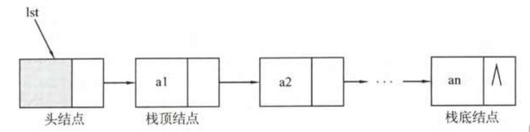

# 栈：数组实现

* 栈是一种特殊的线性表
* **特点后进先出：**，在一端进行删除和增加

## 结构体

```c
/*栈的数组实现*/
#include <stdbool.h>
#define MAX_SIZE 100

typedef struct SqStack {
    int data[MAX_SIZE];
    int top;
} SqStack;
```

## 初始化

```c
/*初始化*/
Stack CreateStack(void) {
    Stack s;
    s.top = -1;
    /*也可以为0，但会浪费一个空间*/
    /*栈顶元素 s.data[s.top]*/
    return s;
}
```

## 进栈

```c
/*压栈*/
bool Push(Stack *s, int data) {
    if (s->top == MAX_SIZE - 1) { return false; } /*满栈*/
    else {
        s->top++;
        s->data[s->top] = data;
        return true;
    }
}
```

## 出栈

```c
/*出栈*/
bool Pop(Stack* s, int* e) {
    if (s->top == -1) { return false; } /*空栈*/
    else {
        /*先出栈，再指针操作*/
        *e = s->data[s->top];
        s->top--;
    }
}
```

## 读取栈顶

```c
bool GetStackTop(Stack s, int *e) {
    if (s.top == -1) { return false; } /*空栈*/
    else {
        *e = s.data[s.top];
        return true;
    }
}
```

## 栈是否为空

```c
/*判断栈是否为空*/
bool StackIsEmpty(Stack s) {
    if (s.top == -1) {
        return true;
    }
    else {
        return false;
    }
}
```

## 栈的高度

```c
/*栈的长度*/
int StackLength(Stack s) { return s.top + 1; }
```

# 栈：链表实现



## 结构体

```c
/*链栈的实现*/

/*结构体定义*/
#include <stdbool.h>
#include <stdlib.h>

typedef struct LinkStackNode {
    int data;
    struct LinkStackNode* next;
} LinkStackNode;
```

## 创建链栈

```c
/*创建链栈*/
LinkStackNode* CreateLinkStack(void) {
    LinkStack *top = (LinkStackNode*)malloc(sizeof(LinkStackNode));
    top->next = NULL;
    return top;
}
```

## 栈是否为空

```
/*栈是否为空*/
bool LinkStackIsEmpty(LinkStackNode *s) {
    if (s->next == NULL) {
        return true;
    }
    else {
        return false;
    }
}
```

## 进栈

```
/*进栈*/
void LinkStackPush(LinkStackNode* s, int data) {
    LinkStackNode* node = (LinkStackNode*)malloc(sizeof(LinkStackNode));
    node->data = data;
    node->next = s->next;
    s->next = node;
}
```

## 出栈

```
/*出栈*/
bool  LinkStackPop(LinkStackNode *s, int* output) {
    if (s->next == NULL) { return false; } // 空栈
    LinkStackNode *popNode = s->next;
    output = popNode->data;
    s->next = popNode->next;
    free(popNode);
    return true;
}
```
