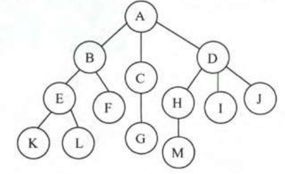
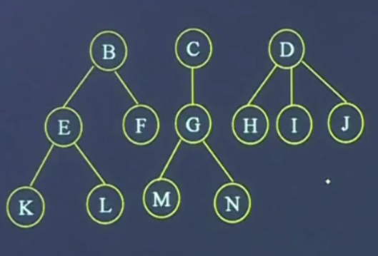
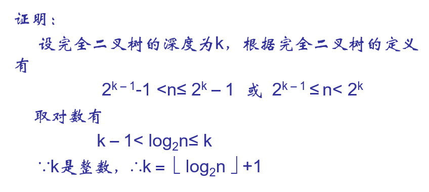
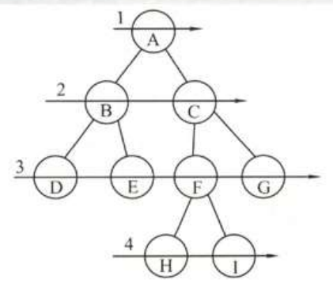

# 树



树是n个节点(A,B,C,D...等)的集合

* n=0时，空树
* 根：图中的A,有且只有一个的节点
* n>1时，其余结点被分为不相交的集合，每一个集合又是一颗子树
* 树是一种递归结构

一些概念

1. 结点：A,B,C等都是结点，结点不仅包含数据，还包含指向子树的分支。
2. 结点的度：子树的个树，比如A的度为3
3. 叶子结点：终端结点，度为0
4. 分支结点：非终端结点，内部结点
5. 孩子结点：一个结点的子树，相应的该结点称为父结点/双亲结点
6. 兄弟结点：同一双亲
7. 层次：根结点的层次为1，其余层次为双亲结点层次+1.
8. 堂兄弟结点：双亲在同一层次的结点
9. 树的深度：根结点到该结点的结点数，又称高度

    * 结点深度和高度是不一样的，树的深度和高度一样。
    * 深度是从上往下；高度是从下往上

10. 有序树：每一个结点的子树，从左到右有一定次序
11. 森林：将树的根结点去掉，剩下的就是森林

    

# 二叉树

*一个结点只有2个子结点*

## 二叉树的性质

### 性质1 非空二叉树的叶子结点等于双分支节点加1

> 非空二叉树上叶子结点,单分支结点,双分支结点分别念为 为$n_0$, $n_1$, $n_2$, 那么 $n_0=n_2+1$
1. 总结点数为 $n=n_0+n_2+n_1$
2. 每个结点(无论是叶子还是单分支)都有树连接, $n_2$有2根树枝, $n_1$有1根树枝,因此共有 $n_1+2n_2$ 根树枝,树枝即结点, 总结点为 $n_1+2n_2+1$
3. $n_1+2n_2+1=n_0+n_2+n_1$ 即 $n_2+1=n_0$

### 性质2 二叉数的第i层最多有 $2^{i-1}$ 个结点

结点最多为满二叉树,即一个以1为首项,公比为2的等比数列, $2^{i-1}$

### 性质3 高度/深度为k的二叉树最多有 $2^k-1$ 个结点

根据等比数列前k项求和公式,同时也是满二叉树的个数

### 性质4 具有n个结点的完全二叉树的深度/高度




### 性质5

将完全二叉树自上而下，自左向右地编号，树根的编号为1。对于编号为i的结点X有：

1. 若i＝1，则X是根；若i>1, 则X的双亲的编号为i/2;
2. 若X有左孩子，则X左孩子的编号为2i；
3. 若X有右孩子，则X右孩子的编号为2i＋1；
4. 若i为奇数且i>1，则X的左兄弟为i－1；
5. 若i为偶数且i<n，则X的右兄弟为i＋1；

## 结构体

```c
typedef struct BtNode{
   char data;
   struct BtNode *lchild, *rchild;
} BtNode, *BiTree;
```

## 创建二叉树

```c
BtNode* createBitree(BtNode *t) {
    printf("输入值");
    char ch;
    ch = getchar();
    getchar();

    if (ch == '#') {
        t = NULL;
        return t;
    }
    else {
        t = (BtNode*)malloc(sizeof(BtNode));
        t->data = ch;
        createBitree(t->lchild);
        createBitree(t->rchild);
        return t;
    }
}
```

## 二叉树的遍历

先序

```c
void PreOrder(BtNode *t) {
    if (t!=NULL) {
        printf("%c", t->data); // visit(t); // 定义visit函数
        PreOrder(t->lchild);
        PreOrder(t->rchild);
    }
}
```

中序

```c
void InOrder(BtNode *t) {
    if (t!=NULL) {
        InOrder(t->lchild);
        printf("%c", t->data); // visit(t); // 定义visit函数
        InOrder(t->rchild);
    }
}
```

后序

```c
void PostOrder(BtNode *t) {
    if (t!=NULL) {
        PostOrder(t->lchild);
        PostOrder(t->rchild);
        printf("%c", t->data); // visit(t); // 定义visit函数
    }
}
```

## 层次访问



需要定义一个队列来实现存储

```c
void Traverse(BtNode bt) {
     InitQueue(Q);             //初始化空队列Q
     EnQueue(Q, bt);        //根入队
     while(!EmptyQueue(Q) ) {
          DeQueue(Q, p);    //队头p出队
          visit(p->data);     //访问p
          if(p->lchild) EnQueue(Q，p->lchild); //p的左孩子入队
          if(p->rchild) EnQueue(Q,p->rchild);  //p的右孩子入队
      }
}
```

```c
#define MAX_NODE 50

//按层次遍历二叉树算法
void level(BtNode *p) {
    //定义一个队列
    int front=0;
    int rear=0;
    BtNode *que[MAX_NODE];

    if (p!=NULL) {
        rear++;  //此处必须加一，为了与循环队列
        que[rear]=p; //根结点入队

        //队列不为空时循环，
        while(front < rear) {
            //出队并访问
            front++;
            p = que[front];
            visit(p->data);

            if (p->lchild !=NULL) {
                rear++;
                que[rear] = p->lchild;
            }
            if (p->rchild !=NULL) {
                rear++;
                que[rear] = p->rchild;
            }

        }
    }
}

```