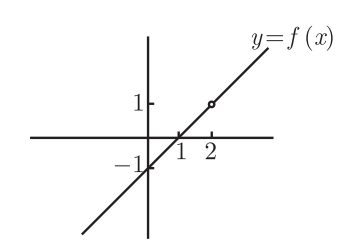
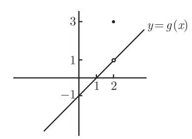
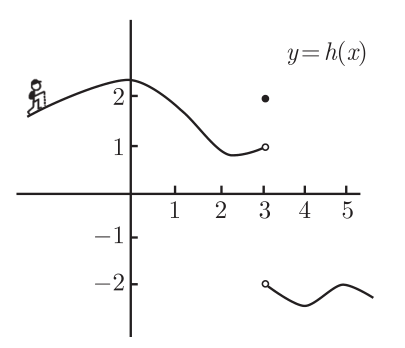
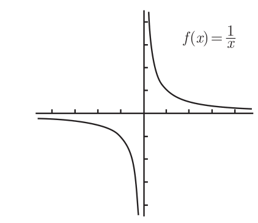
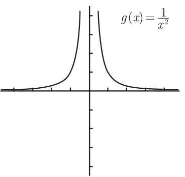
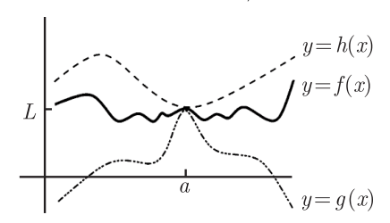
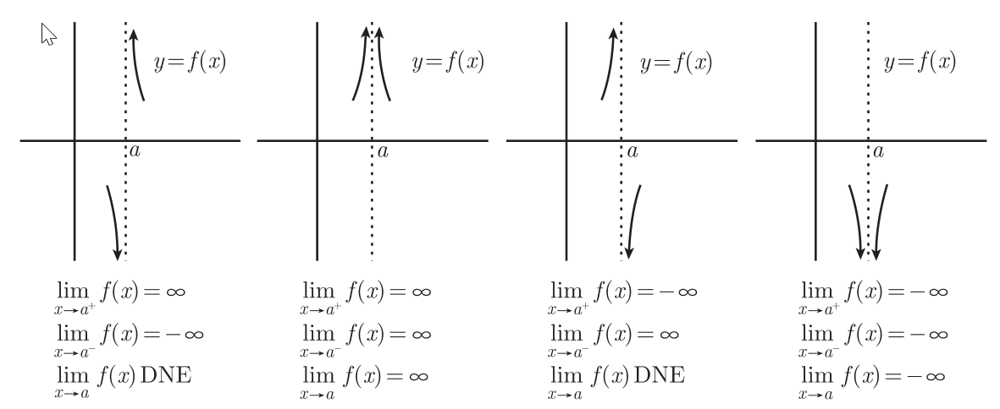
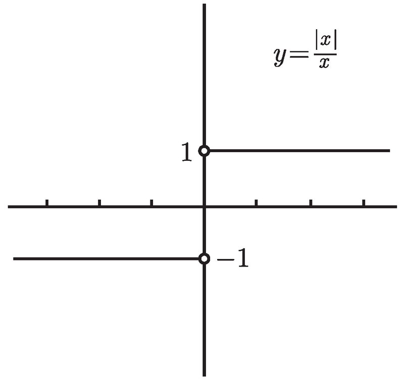
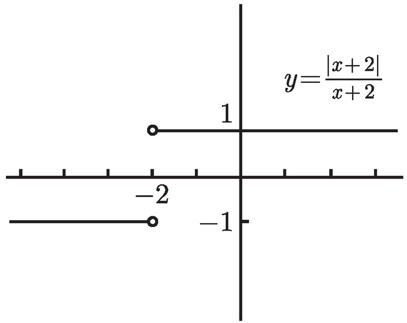

# 极限

对于函数 $f(x)=x-1(x\not=2)$，图像如下：

思考一下 $f(2)$ 的值，$f(2)=1$ 吗，不，2 不在定义域里。但 $f (2.01) = 1.01$ 和 $f (1.999) = 0.999$ 非常接近于这个值。当 x 越接近 2 时 , $f (x)$ 值会越接近于 1。 这里我们直接给出概念:

$\lim\limits_{x->2}f(x)=1$  当 x 趋于 2, f (x) 的极限等于 1

假设函数 $g(x)=\left\{\begin{array}{l}{x-1(x\not=2)} \\ {3(x=2)}\end{array}\right.$ 图像如下

此时g的极限是什么？尽管$g(2)=3$ 但此时的极限仍然是 $\lim\limits_{x->2}g(x)=1$ 因为是 x 接近于 2 时的 g(x) 的值 , 而不是在 2 处的值

## 左右极限

如图函数h(x)在3附近的极限又是什么？

1. 从左边看趋近于1，我们称为左极限 $\lim _\limits{x \rightarrow 3-} h(x)=1$， 3后面的减号表示在3处减去一点点
2. 从右边看趋近于-2，右极限  $\lim _\limits{x \rightarrow 3+} h(x)=-2$

**左极限=右极限时，极限才存在**

## 极限不存在

函数 $f(x)=\frac{1}{x}$

此时 $\lim\limits_{x->0}f(x)$ 是什么，左极限 $\lim\limits_{x->0-}f(x)=-\infty$ 右极限 $\lim\limits_{x->0+}f(x)=\infty$ 显然极限不存在。

函数 $g(x)=\frac{1}{x^2}$,此时x=0处的左右极限都是 $\infty$ 因此 $\lim\limits_{x->0}g(x)=\infty$

## 在正负无穷大处的极限

$\lim_\limits{x\rightarrow{\infty}}f(x)=L$ 和 $\lim_\limits{x\rightarrow{-\infty}}f(x)=L$

## 夹逼定理(三明治定理)

对于所有的在 a 附近的 x, 都有 $g(x) \leqslant f(x) \leqslant h(x)$，且 $\lim\limits_{x\rightarrow a}g(x)=L$ 和 $\lim\limits_{x\rightarrow a}h(x)=L$，那么 $\lim\limits_{x\rightarrow a}f(x)=L$

# 不同类型的极限

## x→a 有理函数的极限

> 有理函数：两个多项式之比 $p(x)/q(x)$ ，比如

$\lim\limits_{x \rightarrow-1} \frac{x^{2}-3 x+2}{x-2}$

如何计算，**直接将 a 代入函数，计算出极限值（只要函数分母不为零）**（学习到连续性后我们会理解为什么这样是正确的）

### 不定式

#### 例子1

$\lim\limits_{x \rightarrow 2} \frac{x^{2}-3 x+2}{x-2}$ 

之前我们使用的方法无法在此使用，因为代入 $x=2$ 会得到式子为 $0/0$，这意味着什么值可能：极限或许是有限的 , 极限或许是 $∞$ 或 $−∞$, 或者极限或许不存在。

此时我们需要因式分解技巧：$\lim\limits_{x \rightarrow 2} \frac{x^{2}-3 x+2}{x-2}=\lim\limits_{x \rightarrow 2} \frac{(x-2)(x-1)}{x-2}=\lim\limits_{x \rightarrow 2}(x-1)=1$

#### 例子2

$\lim\limits_{x \rightarrow 3} \frac{x^{3}-27}{x^{4}-5 x^{3}+6 x^{2}}$

$$
\begin{aligned} \lim _{x \rightarrow 3} \frac{x^{3}-27}{x^{4}-5 x^{3}+6 x^{2}}=& \lim _{x \rightarrow 3} \frac{(x-3)\left(x^{2}+3 x+9\right)}{x^{2}(x-3)(x-2)}=\lim _{x \rightarrow 3} \frac{x^{2}+3 x+9}{x^{2}(x-2)} \\ &=\frac{3^{2}+3 \cdot 3+9}{3^{2}(3-2)}=3 \end{aligned}
$$

> 在分解过程中使用了 $a^{3}-b^{3}=(a-b)\left(a^{2}+a b+b^{2}\right)$

### 分子不为0，分母为0的情况

分母为 0 但分子不为 0 的情况下 , 总会牵扯到一条垂直渐近线。

但如何分辨函数到底是哪种情况？**f (x) 在 x = a 两边的符号**，例子：

$$
\lim _{x \rightarrow 1} \frac{2 x^{2}-x-6}{x(x-1)^{3}}
$$

代入1，得出 -5/0。接下来如何

1. 我们观察 x = 1 时，函数的值。分子 $2x^{2}-x-6$ 的值为-5，即x在1附近时，分子为负数
2. 分母中 x 部分，但x在1附近时，x=1，这一部分为正
3. 分母中 $(x-1)^3$ 部分，x>1时其值为正；x<1时其值为负

用符号表示这个函数：

1. 当 x>1 时 $\frac{(-)}{(+)(+)}=(-)$
2. 当 x<1 时 $\frac{(-)}{(+)(-)}=(+)$

即 x>1时，f(x)是负的；x<1，f(x)是正的。只有第三幅图符合这里的情况。而且双侧极限是不存在的，但存在单侧极限 $\lim\limits_{x \rightarrow 1^{+}} \frac{2 x^{2}-x-6}{x(x-1)^{3}}=-\infty$ 和 $\lim\limits_{x \rightarrow 1^{-}} \frac{2 x^{2}-x-6}{x(x-1)^{3}}=\infty$

---

我们对这个式子进行小改动：

$$
\lim _{x \rightarrow 1} \frac{2 x^{2}-x-6}{x(x-1)^{2}}
$$

1. 当 x>1 时 $\frac{(-)}{(+)(+)}=(-)$
2. 当 x<1 时 $\frac{(-)}{(+)(+)}=(-)$

此时左右极限都是负无穷大，$\lim\limits_{x \rightarrow 1} \frac{2 x^{2}-x-6}{x(x-1)^{2}}=-\infty$

## x→a 时平方根的极限

$$
\lim _{x \rightarrow 5} \frac{\sqrt{x^{2}-9}-4}{x-5}
$$

代入 x=5 ,会得到 0/0 型，也无法进行因式分解。

正确的解法，把分子乘以 $\sqrt{x^{2}-9}+4$ ，也就是 $\sqrt{x^{2}-9}-4$的共轭表达式。

$$
\lim _{x \rightarrow 5} \frac{\sqrt{x^{2}-9}-4}{x-5}=\lim _{x \rightarrow 5} \frac{\sqrt{x^{2}-9}-4}{x-5} \times \frac{\sqrt{x^{2}-9}+4}{\sqrt{x^{2}-9}+4}
$$

$$
=\lim _{x \rightarrow 5} \frac{x^{2}-25}{(x-5)(\sqrt{x^{2}-9}+4)}=
\lim _{x \rightarrow 5} \frac{(x-5)(x+5)}{(x-5)(\sqrt{x^{2}-9}+4)}=\lim _{x \rightarrow 5} \frac{x+5}{\sqrt{x^{2}-9}+4}
$$

代入 5，求出极限 5/4 .

## x→∞ 时有理函数的极限

我们要求的极限是 $\lim\limits_{x \rightarrow \infty} \frac{p(x)}{q(x)}$ p和q为多项式。

对于多项式函数 p(x)，那么当 x 变得越来越大时 , p(x) 的极限就好像只依赖与它的首项一样。比如 $p(x)=3 x^{3}-1000 x^{2}+5 x-7$。假设$p_{L}(x)=3 x^{3}$。但 x 变得很大时，p(x) 和 $p_{L} (x)$ 会相对地非常接近,即

$$
\lim _{x \rightarrow \infty} \frac{p(x)}{p_{L}(x)}=1
$$

> 为何是首项呢？
>
> 对于 $x^{3}-1000 x^{2}+5 x-7$ 和 $p_{L}(x)=3 x^{3}$ ，可以带入一个数进行比较
>
> * x=100时，p(100) 大概是负七百万，$p_{L} (100)$ 是三百万，但100还不够大
> * x=1000000时，p(x)接近于三百万万亿，$p_{L} (x)$ 也是接近于三百万万亿，这时候两个函数值已经很接近了
>
> 这是因为当 x 变大时 , 最高次数项比其他项增长得更快

$$
证明
\lim _{x \rightarrow \infty} \frac{p(x)}{p_{L}(x)}=1
$$

$$
\lim _{x \rightarrow \infty} \frac{p(x)}{p_{L}(x)}=\lim _{x \rightarrow \infty} \frac{3 x^{3}-1000 x^{2}+5 x-7}{3 x^{3}}
$$

$$
=\lim _{x \rightarrow \infty}\left(\frac{3 x^{3}}{3 x^{3}}-\frac{1000 x^{2}}{3 x^{3}}+\frac{5 x}{3 x^{3}}-\frac{7}{3 x^{3}}\right)=\lim _{x \rightarrow \infty}\left(1-\frac{1000}{3 x}+\frac{5}{3 x^{2}}-\frac{7}{3 x^{3}}\right)
$$

此时我们可以把整个极限分为4个单独的极限，当你知道, x 变得非常大时，1  −1000/3x, $5/3x^2$ 和 $−7/3x^3$ 这四个量会发生什么情况的话 , 就可以把这四个极限加在一起来得到你想要求的极限。

“ **和的极限等于极限的和** ”; 这在所有的极限都是有限时候成立

>  如果极限不是有限的 , 它就不成立。比如
>
> $$
\lim _{x \rightarrow \infty}(x+(1-x))
$$
> 此时极限是1。
> 但此式子不能分为 $\lim\limits_{x \rightarrow \infty}(x)+\lim\limits_{x \rightarrow \infty}(1-x)$
> 
> 因为  $\lim\limits_{x \rightarrow \infty}(x)+\lim\limits_{x \rightarrow \infty}(1-x)=\infty+(-\infty)$
>
> 极限不是有限时，不能拆分为几个极限的和

对于 $\lim\limits_{x \rightarrow \infty}\left(1-\frac{1000}{3 x}+\frac{5}{3 x^{2}}-\frac{7}{3 x^{3}}\right)$

* 对于第一个分式，它的值永远为1
* 对于$\lim\limits_{x \rightarrow \infty}-\frac{1000}{3 x}$
    
     −1000/3 是常数 , 不管 x 是什么 , 它都不会改变，可以把数字提出来 $\lim\limits_{x \rightarrow \infty}-\frac{1000}{3} \frac{1}{x}=-\frac{1000}{3} \lim\limits_{x \rightarrow \infty} \frac{1}{x}$

    $x\rightarrow \infty$ 时，1/x 的极限为0

* 实际上对于对于任意的 n > 0, 只要 C 是常数 , 就有$\lim\limits_{x \rightarrow \infty} \frac{C}{x^{n}}=0$， 当 x 变得非常大时 , 其他两项 $5/3x^2$ 和 $−7/3x^3$ 也趋于 0. 

$$
\begin{aligned} \lim _{x \rightarrow \infty} \frac{3 x^{3}-1000 x^{2}+5 x-7}{3 x^{3}} &=\lim _{x \rightarrow \infty}\left(1-\frac{1000}{3 x}+\frac{5}{3 x^{2}}-\frac{7}{3 x^{3}}\right) \\ &=1-0+0+0=1 \end{aligned}
$$

证明完成

### 首项极限的使用方法

当看到某个关于 p 的多项式 p(x) 是多于一项时 , 把它代以 $\frac{p(x)}{p(x)的首项}\times p(x)的首项$ ，对于分子分母都这样做。

#### 例子1

$$
\lim _{x \rightarrow \infty} \frac{x-8 x^{4}}{7 x^{4}+5 x^{3}+2000 x^{2}-6}
$$

对分子和分母都进行乘以首项操作

$$
\lim _{x \rightarrow \infty} \frac{x-8 x^{4}}{7 x^{4}+5 x^{3}+2000 x^{2}-6}=\lim _{x \rightarrow \infty} \frac{\frac{x-8 x^{4}}{-8 x^{4}} \times\left(-8 x^{4}\right)}{\frac{7 x^{4}+5 x^{3}+2000 x^{2}-6}{7 x^{4}} \times\left(7 x^{4}\right)}
$$

$$
=\lim _{x \rightarrow \infty} \frac{-\frac{1}{8 x^{3}}+1}{1+\frac{5}{7 x}+\frac{2000}{7 x^{2}}-\frac{6}{7 x^{4}}} \times \frac{-8 x^{4}}{7 x^{4}}
$$

此时我们最关注的是 $\frac{-8 x^{4}}{7 x^{4}}$,因为其他的表达式根据`当 x → ∞ 时 , 任何形如 $C/x^n$ 的表达式都趋于 0( 只要 C 是常数 , 且 n > 0)`. 因此 , 大多数的项就消失了

$$
\lim _{x \rightarrow \infty} \frac{x-8 x^{4}}{7 x^{4}+5 x^{3}+2000 x^{2}-6}=\lim _{x \rightarrow \infty} \frac{-\frac{1}{8 x^{3}}+1}{1+\frac{5}{7 x}+\frac{2000}{7 x^{2}}-\frac{6}{7 x^{4}}} \times \frac{-8 x^{4}}{7 x^{4}}=\frac{0+1}{1+0+0-0} \times \frac{-8}{7}=\frac{1}{1} \times \frac{-8}{7}=\frac{-8}{7}
$$

#### 例子2

$$
\lim _{x \rightarrow \infty} \frac{\left(x^{4}+3 x-99\right)\left(2-x^{5}\right)}{\left(18 x^{7}+9 x^{6}-3 x^{2}-1\right)(x+1)}
$$

$$
=\lim _{x \rightarrow \infty} \frac{\left(\frac{x^{4}+3 x-99}{x^{4}} \times\left(x^{4}\right)\right)\left(\frac{2-x^{5}}{-x^{5}} \times\left(-x^{5}\right)\right)}{\left(\frac{18 x^{7}+9 x^{6}-3 x^{2}-1}{18 x^{7}} \times\left(18 x^{7}\right)\right)\left(\frac{x+1}{x} \times(x)\right)}
$$

$$
=\lim _{x \rightarrow \infty} \frac{\left(1+\frac{3}{x^{3}}-\frac{99}{x^{4}}\right)\left(-\frac{2}{x^{5}}+1\right)}{\left(1+\frac{9}{18 x}-\frac{3}{18 x^{5}}-\frac{1}{18 x^{7}}\right)\left(1+\frac{1}{x}\right)} \times \frac{\left(x^{4}\right)\left(-x^{5}\right)}{\left(18 x^{7}\right)(x)}
$$

$$
=\frac{(1+0-0)(0+1)}{(1+0-0-0)(1+0)} \times \lim _{x \rightarrow \infty} \frac{-x}{18}=\lim _{x \rightarrow \infty} \frac{-x}{18}=-\infty
$$

#### 例子3

$$
\begin{aligned} \lim _{x \rightarrow \infty} \frac{2 x+3}{x^{2}-7}=& \lim _{x \rightarrow \infty} \frac{\frac{2 x+3}{2 x} \times(2 x)}{\frac{2 x}{x^{2}-7} \times\left(x^{2}\right)}=\lim _{x \rightarrow \infty}\left(\frac{1+\frac{3}{2 x}}{1-\frac{7}{x^{2}}}\right) \times \frac{2 x}{x^{2}} \\ &=\frac{1+0}{1-0} \times \lim _{x \rightarrow \infty} \frac{2}{x}=0 \end{aligned}
$$

### 总结

对于 $\lim\limits_{x \rightarrow \infty} \frac{p(x)}{q(x)}$
1. 如果 p 的次数等于 q 的次数 , 则极限是有限的且非零
2. 如果 p 的次数大于 q 的次数 , 则极限是 ∞ 或 −∞
3. 如果 p 的次数小于 q 的次数 , 则极限是 0

## x → ∞ 时的多项式型函数的极限

$f(x)=x^3+4x^2-5x^{(2/3)}+1,\\g(x)=\sqrt{x^9-7x^2+2},\\h(x)=x^4-\sqrt{x^3+\sqrt[5]{x^2-2x+3}}$

> 对于上述类型的函数,含有分数次数或 n 次根 , 看起来有点像多项式，我们称它们为多项式型函数。处理方法与上一节类似

### 例子1

$$\lim_{x\to\infty}\frac{\sqrt{16x^4+8}+3x}{2x^2+6x+1}$$

* 对于分母我们可以直接相乘 $\frac{2x^2+6x+1}{2x^2}\times(2x^2)$
* 对于分子最大项为 $\sqrt{16x^4+8}$ 对其最大项取平方根是 $4x^2$，分子这样处理 $\frac{\sqrt{16x^4+8}+3x}{4x^2}\times(4x^2)$

    $\frac{\sqrt{16x^4+8}+3x}{4x^2}=\frac{\sqrt{16x^4+8}}{4x^2}+\frac{3x}{4x^2}=\sqrt{\frac{16x^4+8}{16x^4}}+\frac{3x}{4x^2}=\sqrt{1+\frac{8}{16x^4}}+\frac{3}{4x}.$
* 当x→∞ 时，分子极限为$\sqrt{1+0}+0=1$

整个步骤

$$
\begin{aligned}\lim_{x\to\infty}\frac{\sqrt{16x^4+8}+3x}{2x^2+6x+1}&=\lim_{x\to\infty}\frac{\frac{\sqrt{16x^4+8}+3x}{4x^2}\times(4x^2)}{\frac{2x^2+6x+1}{2x^2}\times(2x^2)}\\&=\lim_{x\to\infty}\frac{\sqrt{\frac{16x^4+8}{16x^4}}+\frac{3x}{4x^2}}{\frac{2x^2+6x+1}{2x^2}}\times\frac{4x^2}{2x^2}=\lim_{x\to\infty}\frac{\sqrt{1+\frac{8}{16x^4}}+\frac{3}{4x}}{1+\frac{6}{2x}+\frac{1}{2x^2}}\times\frac{4}{2}\\&=\frac{\sqrt{1+0}+0}{1+0+0}\times2=2\end{aligned}
$$

### 例子2

$$\lim_{x\to\infty}\frac{\sqrt{16x^4+8}+3x^3}{2x^2+6x+1}$$

* 此时分子最高次项为 $3x^3$, 消除方法 $\frac{\sqrt{16x^4+8}+3x^3}{3x^3}\times(3x^3)$

整个过程

$$
\begin{aligned}\lim_{x\to\infty}\frac{\sqrt{16x^4+8}+3x^3}{2x^2+6x+1}&=\lim_{x\to\infty}\frac{\frac{\sqrt{16x^4+8}+3x^3}{3x^3}\times(3x^3)}{\frac{2x^2+6x+1}{2x^2}\times(2x^2)}\\&=\lim_{x\to\infty}\frac{\sqrt{\frac{16x^4+8}{9x^6}}+\frac{3x^3}{3x^3}}{\frac{2x^2+6x+1}{2x^2}}\times\frac{3x^3}{2x^2}=\lim_{x\to\infty}\frac{\sqrt{\frac{16}{9x^2}+\frac{8}{9x^6}}+1}{1+\frac{6}{2x}+\frac{1}{2x^2}}\times\frac{3x}{2}\\&=\frac{\sqrt{0+0}+1}{1+0+0}\times\lim_{x\to\infty}\frac{3x}{2}=\infty.\end{aligned}
$$

### 例子3

前面的例子1最高项在 $4x^2$ 例子2 最高项在 $3x^3$，如果根号内和根号外都是最高项的情况，如何求解

$$\lim_{x\to\infty}\frac{\sqrt{4x^6-5x^5}-2x^3}{\sqrt[3]{27x^6+8x}}$$

先考虑分子，平方根下最高项为 $\sqrt{4x^6}$ 即 $2x^3$，但我们分子乘以 $2x^3$ 后整个分子都将变为0。此时我们需要乘以共轭表达式

$$
\lim_{x\to\infty}\frac{\sqrt{4x^6-5x^5}-2x^3}{\sqrt[3]{27x^6+8x}}=\lim_{x\to\infty}\frac{\sqrt{4x^6-5x^5}-2x^3}{\sqrt[3]{27x^6+8x}}\times\frac{\sqrt{4x^6-5x^5}+2x^3}{\sqrt{4x^6-5x^5}+2x^3}
$$

$$
=\lim_{x\to\infty}\frac{(4x^6-5x^5)-(2x^3)^2}{\sqrt[3]{27x^6+8x}(\sqrt{4x^6-5x^5}+2x^3)}
$$

$$
=\lim_{x\to\infty}\frac{-5x^5}{\sqrt[3]{27x^6+8x}(\sqrt{4x^6-5x^5}+2x^3)}
$$

分子已经不需要处理了，再考虑分母 $\sqrt[3]{27x^6+8x}$，乘以再除以$27x^6$的立方根。即 $\frac{\sqrt[3]{27x^6+8x}}{\sqrt[3]{27x^6}}\times\sqrt[3]{27x^6}=\sqrt[3]{\frac{27x^6+8x}{27x^6}}\times(3x^2)=\sqrt[3]{1+\frac{8}{27x^5}}\times(3x^2)$

当 x 趋近于无穷大时，根号内的部分极限为1。

另一个分母 $\sqrt{4x^6-5x^5}{+2x^3}$ ，$4x^6$的平方根为$2x^3$，但分子还有一项 $2x^3$ 把这一项加上去得到总的分子 $4x^3$

$\frac{\sqrt{4x^6-5x^5}+2x^3}{4x^3}\times(4x^3)\\=\Biggl(\sqrt{\frac{4x^6-5x^5}{16x^6}}+\frac{2x^3}{4x^3}\Biggr)\times(4x^3)=\Biggl(\sqrt{\frac{1}{4}-\frac{5}{16x}}+\frac{1}{2}\Biggr)\times(4x^3).$

当x趋近于无穷大时，$\sqrt{\frac{1}{4}-0}+\frac{1}{2}=\frac{1}{2}+\frac{1}{2}=1$

将整个式子放在一起

$$
\lim_{x\to\infty}\frac{-5x^5}{\sqrt[3]{27x^6+8x}(\sqrt{4x^6-5x^5}+2x^3)}
$$

$$
=\lim_{x\to\infty}\frac{-5x^5}{\biggl(\frac{\sqrt[3]{27x^6+8x}}{\sqrt[3]{27x^6}}\times(3x^2)\biggr)\biggl(\frac{\sqrt{4x^6-5x^5}+2x^3}{4x^3}\times(4x^3)\biggr)}
$$

$$
=\lim_{x\to\infty}\frac{1}{\biggl(\frac{\sqrt[3]{27x^6+8x}}{\sqrt[3]{27x^6}}\biggr)\biggl(\frac{\sqrt{4x^6-5x^5}+2x^3}{4x^3}\biggr)}\times\frac{-5x^5}{(3x^2)(4x^3)}=-5/12
$$

## x→−∞ 时的有理函数的极限

$$
\lim_{x\to-\infty}\frac{p(x)}{q(x)}
$$

当 x 是一个非常大的负数时, 最高次数项仍然会占主导. 此外, 当 x → -∞ 时, 只要 C 是常数, 且 n 是一个正整数, $C/x^n$ 仍然趋于 0。

### 例子1

之前的一个例子，将趋近于无穷大改为趋近于负无穷大

$$
\begin{aligned}\lim_{x\to-\infty}\frac{x-8x^4}{7x^4+5x^3+2000x^2-6}&=\lim_{x\to-\infty}\frac{\frac{x-8x^4}{-8x^4}\times(-8x^4)}{\frac{7x^4+5x^3+2000x^2-6}{7x^4}\times(7x^4)}\\&=\lim_{x\to-\infty}\frac{-\frac{1}{8x^3}+1}{1+\frac{5}{7x}+\frac{2000}{7x^2}-\frac{6}{7x^4}}\times\frac{-8}{7}=-\frac{8}{7}\end{aligned}
$$

这个例子x趋近于正负无穷大时，极限是一样的

### 例子2

$$
\begin{aligned}&\lim_{x\to-\infty}\frac{(x^4+3x-99)(2-x^5)}{(18x^7+9x^6-3x^2-1)(x+1)}\\=&\lim_{x\to-\infty}\frac{\biggl(\frac{x^4+3x-99}{x^4}\times(x^4)\biggr)\biggl(\frac{2-x^5}{-x^5}\times(-x^5)\biggr)}{\biggl(\frac{18x^7+9x^6-3x^2-1}{18x^7}\times(18x^7)\biggr)\biggl(\frac{x+1}{x}\times(x)\biggr)}\\=&\lim_{x\to-\infty}\frac{\biggl(1+\frac{3}{x^3}-\frac{99}{x^4}\biggr)\biggl(-\frac{2}{x^5}+1\biggr)}{\biggl(1+\frac{9}{18x}-\frac{3}{18x^5}-\frac{1}{18x^7}\biggr)\biggl(1+\frac{1}{x}\biggr)}\times\lim_{x\to-\infty}\frac{(x^4)(-x^5)}{(18x^7)(x)}\\=&\frac{(1+0-0)(-0+1)}{(1+0-0-0)(1+0)}\times\lim_{x\to-\infty}\frac{-x}{18}=\lim_{x\to-\infty}\frac{-x}{18}=\infty\end{aligned}
$$

对于函数趋近于正无穷大和负无穷大时，极限的值不同

### 化简因子

> 之前将因子拖进平方根符号里的时候并没有特别小心, 比如 $\sqrt{x^2}=x$ 吗？ 如果不幸 x 是负的,就错了。当面对 x → -∞ 时的多项式型函数的极限时, 类似情况也会出现

$$\lim_{x\to-\infty}\frac{\sqrt{4x^6+8}}{2x^3+6x+1}$$

此时 $\sqrt{4x^6}$ 看似可以化简为$2x^3$，但x趋近于负无穷大，因此应该是$-2x^3$

整个过程

$$
\begin{aligned}&\lim_{x\to-\infty}\frac{\sqrt{4x^6+8}}{2x^3+6x+1}=\lim_{x\to-\infty}\frac{\frac{\sqrt{4x^6+8}}{\sqrt{4x^6}}\times\sqrt{4x^6}}{\frac{2x^3+6x+1}{2x^3}\times(2x^3)}\\=&\lim_{x\to-\infty}\frac{\sqrt{\frac{4x^6+8}{4x^6}}}{\frac{2x^3+6x+1}{2x^3}}\times\frac{\sqrt{4x^6}}{2x^3}=\lim_{x\to-\infty}\frac{\sqrt{1+\frac{8}{4x^6}}}{1+\frac{6}{2x^3}+\frac{1}{2x^3}}\times\frac{-2x^3}{2x^3}\\=&\frac{\sqrt{1+0}}{1+0+0}\times(-1)=-1\end{aligned}
$$

> 但 $\sqrt{x^4}=x^2$ 必定为正，$x^2$必定为正
>
> 

## 绝对值的极限

例子 

$$\lim_{x\to0^-}\frac{|x|}{x}$$

该函数的图像

* 对于做左极限 $\lim\limits_{x\to0^-}\frac{|x|}{x}=-1$
* 右极限 $\lim\limits_{x\to0^+}\frac{|x|}{x}=1$
* 左右极限不相等，极限不存在

另一个例子

$$\lim_{x\to(-2)^-}\frac{|x+2|}{x+2}$$

这个函数依赖于 x + 2 ≥ 0 还是 x + 2 < 0。当 x > -2 时, |x + 2| / (x + 2) 等于 1; 而当 x < -2 时, 它则是 -1。要求的左极限等于 -1 (同时, 右极限是 1, 故双侧极限不存在).