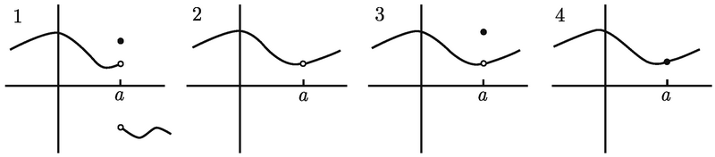
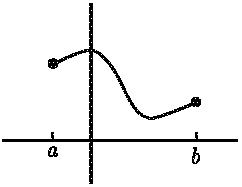
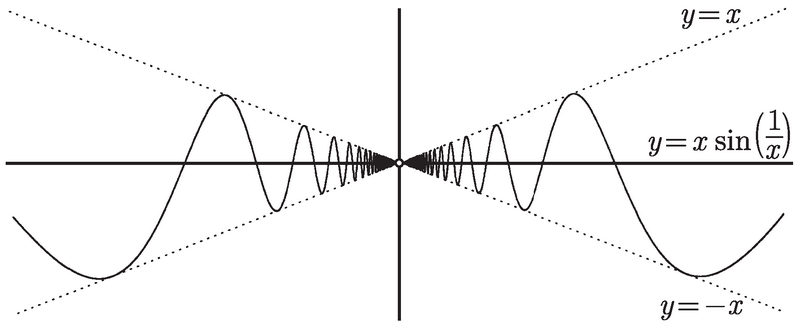
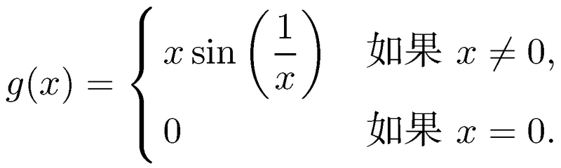
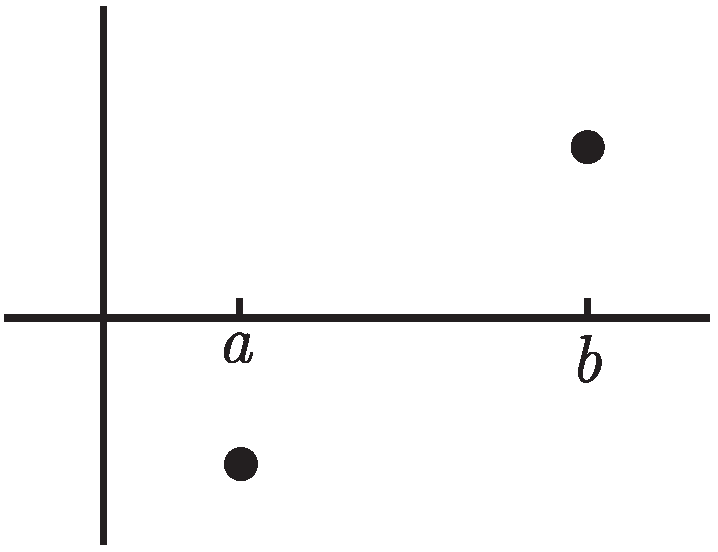
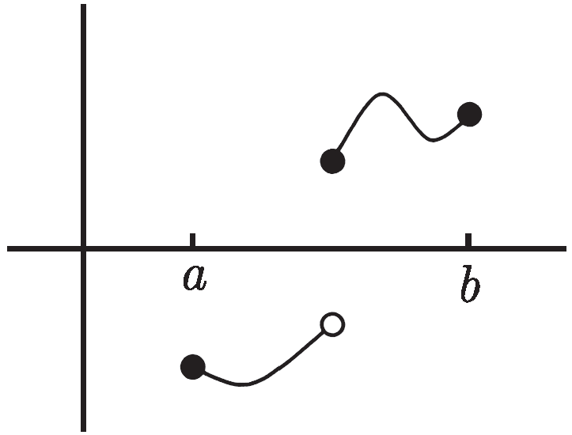
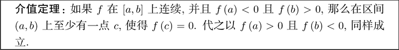
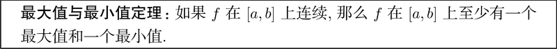

# 连续性

*直觉上, 可以一笔画出连续函数的图像就是连续。对于 y = x^2 这样的函数来说没有问题, 整个图像在一块; 对于 y = 1/x 这样的函数, 就不好判断了。因此我们需要先搞清什么是连续。*

## 在一点处连续

**如果$\lim\limits_{x→a}f(x)=f(a)$，函数f在x=处连续**,补充

1. 双侧极限 $\lim\limits_{x\to a}f(x)$存在 (并且是有限的)
2. 函数在点 x = a 处有定义, 即 f(a) 存在 (并且是有限的)

看下图中关于函数连续性讨论

1. 图1中，函数在a点左右极限不同，双侧极限不存在所以函数在a点不连续
2. 图2中，函数在a点极限存在，但函数定义域不包含a点，函数在a点不连续
3. 图3中，函数在a点极限和a点的函数值不同，函数在a点不连续
4. 图4中，函数在a点有双侧极限，并且和在a点的函数值相同，因此函数在a点是连续的
5. 我们称图1，2，3中a点为不连续点

## 在一个区间上连续

**如果函数在区间 (a, b) 上的每一点都连续, 那么它在该区间上连续**

> 函数实际上没有必要在端点 x = a 或 x = b 上连续
>  
>  例如, f(x) = 1/x。
> 1. f在区间 (0, ∞) 上连续, 即使f(0)无定义. 
> 2. 该函数在区间 (-∞, 0) 上也连续
> 3. 但在区间 (-2, 3) 上不连续, 因为 0 位于此区间内, 而f在那里不连续

### 对于[a,b]的连续

上图为一个函数在[a,b]上的图像，我们想说它在[a,b]上连续，需要以下条件

1. 函数 f 在 (a, b) 中的每一点都连续
2. 函数 f 在点 x = a 处右连续，即$\lim\limits_{x\to a+}f(x)=f(a)$
3. 函数 f 在点 x = b 处左连续, 即$\lim\limits_{x\to a-}f(x)=f(b)$

## 连续性的例子

* f(x)=1是连续的吗，即证明任意一点a在f上连续，即证明$\lim\limits_{x\to a}f(x)=f(a)$, 显然$\lim_{x\to a}1=1$，因此f(x)=1是连续的
* g(x)=x是连续的吗，即证明 $\lim\limits_{x\to a}g(x)=g(a)$，即证明 $\lim\limits_{x\to a}x=a$，显然成立

> 一个连续函数的常数倍是连续的; 此外, 如果对两个连续函数做加法、减法、乘法或复合, 会得到另一个连续函数. 当用一个连续函数除以另一个连续函数的时候, 这几乎也一样成立：除了分母为零的点外, 商函数处处连续.

* 而对于多项式函数，因为 g(x)=x 是连续函数, 可以让 g 和它自己相乘, 看到 x^2 也是连续函数。我们可以进行多次乘法和加法，因此多项式函数也是连续的
* 指数函数，对数函数也是连续的
* 三角函数除了在渐近线上外是连续的

### f(x) = xsin(1/x)

考虑这个函数的连续性，$f(x) = xsin(1/x)$

* 除了x=0，1/x在其他处都是连续的。与sin函数相复合，得到的函数也是连续的，再乘以x依然是连续的
* 除了x=0，其他都是连续的

我们可以人为的将这一块空缺补上，定义一个函数g(x)

x=0时，f(0)=0，因此, g 必然是处处连续的。

> 可以用夹逼定理证明这个极限 $\lim\limits_{x\to0^+}g(x)=\lim\limits_{x\to0^+}x\sin\biggl(\frac{1}{x}\biggr)=0$ 
>  
> $\lim\limits_{x\to0}g(x)=\lim\limits_{x\to0}x\sin\biggl(\frac{1}{x}\biggr)=0=g(0)$

### $\lim\limits_{x\to-1}\frac{x^2-3x+2}{x-2}$

$\lim\limits_{x\to-1}\frac{x^2-3x+2}{x-2}$，上一章的一个例子，为什么这个函数的极限直接代入-1即可。因为该函数的分子分母都是多项式，除了分母为0外其余处处连续。$\lim\limits_{x\to-1}f(x)=f(-1)$

## 介值定理

> 这里给出的实际上是**零点定理**

假设函数 f 在 [a, b] 上连续 f(a) < 0 且 f (b) > 0 

* f是连续的，可能是一条直线连起来；也可能如下图

    

* 因为f连续，该函数肯定有个点c使f(c)=0

### 例子1

$p (x) = -x^5 + x^4 + 3x + 1$ 在 x = 1 和 x = 2 之间有一个 x 轴截距。

函数p是一个连续的函数，p(1)=4>0；p(2)=-9<0;因此存在一个点c使p(c)=0

### 例子2

>  如何证明方程 x = cos (x) 有一个解

1. 令f(x)=x-cos(x)
2. f(0)=0-cos0=0
3. $f(\pi/2)=\pi/2$
4. 因为函数是连续的，根据零点定理函数存在c点使f(c)=0

### TODO 例子3

> 证明任意的奇数次多项式至少有一个根.

## 连续函数的最大值和最小值

# 可导性

可导性意味着函数有导数

> 发展微积分最初灵感之一来自运动物体的速度、距离和时间的关系. 

行驶的汽车速率=距离/时间，但这个速度是平均速度，汽车的速度是不断变化的。

> 瞬时速度，在给定的瞬间, 如何测量汽车的速度？基本思想就是, 在始于拍照时刻并变得越来越小的时间段上, 求汽车的平均速度

我们用t表示汽车某个瞬时时间的起始时间，u表示终止时间，u越接近t这个时间越短，能有多就多近即极限(h=u-t) $\lim\limits_{h\to0}\frac{f(t+h)-f(t)}{h}$

> 假设处于静止状态的汽车从 7 英里标志处向右开始加速, 并设此时刻 t = 0 小时. 结果表明, 汽车在时刻 t 的位置好像是 $15t^2 + 7$ 。设 $f (t) = 15t^2 + 7$

$$
\lim_{h\to0}\frac{15t^2+30th+15h^2+7-15t^2-7}{h}=\lim_{h\to0}\frac{30th+15h^2}{h}=\lim_{h\to0}(30t+15h)
$$

代入 h=0，那么瞬间速度为 $=\lim_{h\to0}(30t+15h)=30t$

