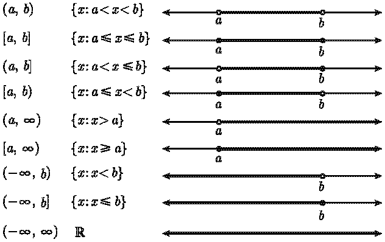

# 1.1 函数

函数对微积分来说就像是“建筑材料”一样，什么是函数？

$y=f(x)$

函数: 将一个对象x转化为另一个对象y的规则, 上式子中 f 就是一个函数。

1. 起始对象x称为输入, 来自称为 **定义域** 的集合
2. 返回对象y称为输出, 输出则属于一个集合 **上域**，实际输出值构成了一个集合**值域**
3. 一个函数必须给 **每一个有效的输入指定唯一的输出**

---

一些函数的例子:

* $f(x)=x^2$ 这个式子定义了函数 $f$ ，它会将任何数变为自己的平方。函数 $f$ 并没有规定定义域，默认定义域为 $\mathbb{R}$(所有实数的合集)。对于任意实数，$f$ 将该实数变为变为其平方。比如 $f(2)=4$, $f(-\frac{1}{2})=\frac{1}{4}$
* $g(x)=x^2$，**定义域为非负数**。函数 $g$ 看上去和 $f$ 一样，实际上二者的定义域不同， $f(-1/2) = 1/4$, 但 $g(-1/2)$ 不存在。g 和 f 有相同的规则，g 是限制 f 的定义域产生的。

---

一个函数必须给每一个有效的输入指定唯一的输出，这个输出构成了值域。

* **值域**：值域是函数的输出集合。函数转变其定义域中的一切对象, 每次转变一个对象; 转变后的对象所组成的集合称作值域。
* **上域**：上域是函数可能输出的集合，值域是实际输出的集合

例子：

* $f(x)=x^2$ 其定义域和值域都是 $\mathbb{R}$，值域是非负集合
* $g(x)=x^2$ 其定义域为非负数集合，上域为$\mathbb{R}$,值域为非负集合

## 1.1.1 区间表示法

学习函数过程中经常会遇到实轴的子集, 比如 {x : 2 ≤ x < 5} 这样的连通区间，我们使用区间表示法来来表示这些范围：

* [a, b] 表示满足 a≤x≤b 成立的 x 的集合，比如 [2, 5] 就是所有满足 2≤x≤5 的x。x 的值可以取为a或者b, [a, b] 这样的区间被称为**闭区间**
* (a, b) 则表示 满足 a<x<b 成立的 x 的集合，被称为**开区间**
* [a, b) 表示**半开半闭区间**

## 1.1.2 求定义域

求定义域分为2种情况

1. 函数的定义中包括定义域,比如:$g(x)=x^2(x\ge 0)$
2. 定义域没给出时, 定义域包括实数集尽可能多的部分
   
   比如$k=\sqrt x$ 定义域为 $[0, \infty )$
   
常见几种定义域情况：

1. 分母不为零.
2. 不能取负数的平方根 (或四次根, 六次根, 等等).
3. 不能取一个负数或零的对数

比如: 对于$tan(x)$ 来说 $tan(90°)$ 无意义 $\frac{sin(90°)}{cos(90°)}=\frac{1}{0}$

另一个例子 $f(x)=\frac{\log_{10}(x+8)\sqrt{26-2x}}{(x-2)(x+19)}$, 求函数的定义域
* 开平方根必须是正数，26-2x≥0，即x≤13
* 对数必须大于0， x+8>0，即x>-8
* 分母不为0，x≠2且x≠-19
* 定义域合起来就是 (-8, 13] \ 2，反斜杠表示 “不包括”