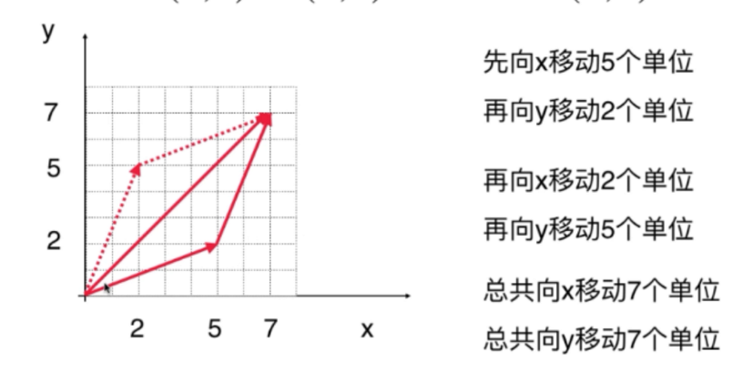
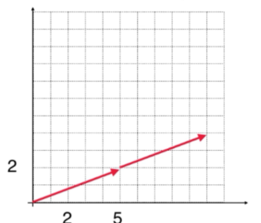

# 1.3 向量的加法和数乘

## 向量的加法

向量的加法：只要两个向量行数和列数都相同，将2个向量的每一个对应的数字相加即可。

$(5,2)^T+(2,5)^T=(7,7)^T$

从图像上讲，把第一个向量的终点作为第二个向量的起点，再接上第二个向量就是两个向量的和

## 向量的数乘

向量的数乘：

$2\times (5,2)^T=(10,4)^T$

从图像角度，数乘就是n个向量相加

