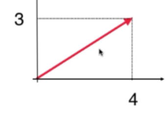
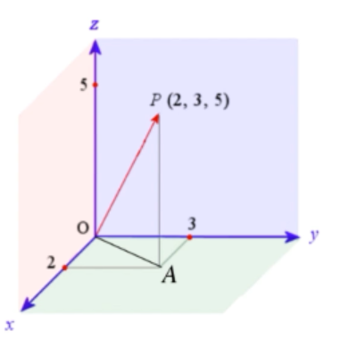
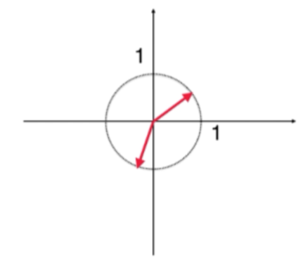

# 1. 向量

## 1.6 向量的长度

二维平面上 $\vec u=(3,4)$

向量的长度称为模，用符号$||\vec v||$表示。$||\vec u||=\sqrt{3^2+4^2}=5$

### 三维向量的模
向量$\vec u=(2,3,5)$的模为$||\vec u||=\sqrt{2^+3^2+5^2}$

> * 先算出x y平面的模，再结合z轴上的模计算

### n维向量的模

$||\vec n||=\sqrt{u_1^2+u_2^2+\dots+u_n^2}$

## 1.7 单位向量

**模等于1的向量是单位向量**

* 单位向量有无数个

    
* 普通向量转化为单位向量 $\widehat {u}=\frac{1}{||\vec u||}\vec u$，比如 $\vec u=(3,4)$ 对应的单位向量是 $\frac{1}{\sqrt{3^2+4^2}}(3,4)=(\frac{3}{5},\frac{4}{5})$

### 特殊的单位向量

有一些特殊的单位向量，叫做**标准单位向量**，一般用$\vec e$表示：

* 二维空间的$\vec e_1=(1,0)$, $\vec e_2=(0,1)$
* 三维空间的$\vec e_1=(1,0,0)$, $\vec e_2=(0,1,0)$, $\vec e_3=(0,0,1)$
* n维空间的$\vec e_1=(1,0,\dots,0)$, ..., $\vec e_n=(0,0,\dots,1)$

> 后续会解释为什么标准单位向量特殊