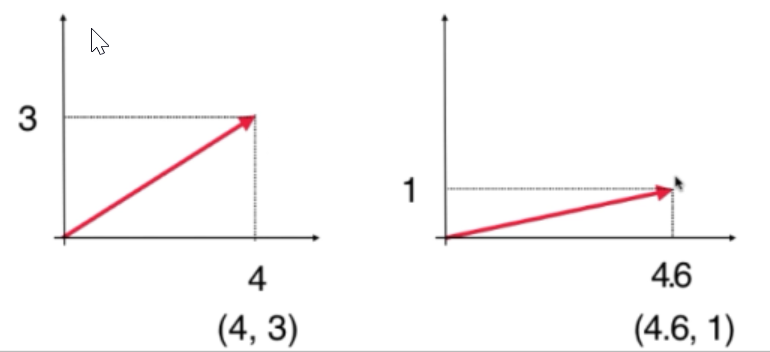

|                          初等数学                          |                      线性代数                       |
| ---------------------------------------------------------- | -------------------------------------------------- |
| 初等数学是在研究一个一个数                                   | 线性代数是研究一组数$(x_1 x_2 \dots x_n)$(向量)      |
| 一个数可能属于集合 $\mathbb{N}$(整数集) $\mathbb{R}$(实数集) | 而一组数属于不同的空间 $\mathbb{N}^n$ $\mathbb{R}^n$ |
| 函数f(x)针对一个数                                          | 针对一组数的函数：$M(\vec v)$(矩阵)                  |

这样一组数就是向量 $\vec x=(x_1 x_2 \dots x_n)$

> 为什么需要向量，因为真实的世界是多维度的；一个数不足以描述真实世界。

# 1. 向量

向量是线性代数研究的基本元素，简单理解就是一组数，比如(6,66,666)。

从图形角度看，向量中的这些数表示了向量的方向，第一个数表示向量在x轴上的量，第二个数字表示y轴的，依此类推

* 不同的数字代表不同轴上的值，因此 (4,3) 和 (3,4) 是不同的，可以理解为向量的数字是有顺序的
* 线性代数中, 起始点是不重要的，但为了便于理解,统一将向量的起点设为原点。

> **n维**
>
> 但如果只是表示方向,只需要3维. 但线代中包含更多维度，即n维向量 $\vec x=(x_1 x_2 \dots x_n)$
>
> 还有从其他角度看待向量的方式，比如描述一个房子120平方，价值200万，3间卧室，2间客厅，可以写为(120, 200 ,3 2)。这个角度看待向量是有顺序的量组成的点，后文会解释如何定义向量

    
