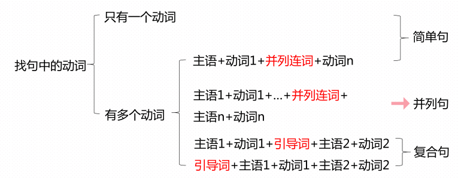

# 句子成分：构成句子的各个部分

句子成分可以是**单词、短语，也可以是句子**，英语中有8大句子成分。

成分
1. 主干：主语 谓语 标语 宾语
2. 配角：补足语 定语 状语 同位语

## 主语

* 句子叙述的主体，句中动作的发出者。（**我们可以把所有句子都概括为“谁[主语]做什么”**）
* 主语可以是名词、代词、数词、非谓语动词、从句

|    主语    |                               例句                                |
| --------- | ----------------------------------------------------------------- |
| 名词       | This moive tells a sweet love story. 这部电影讲了一个甜蜜的爱情故事 |
| 代词       | You should take an umbrella with you.                             |
| 数词       | **80%** of the students in this college are girls.                |
| 非谓语动词 | **Lying** is wrong.  (动名词作主语)                                |
| 从句       | **what they need** is time.                                       |

## 谓语

* 谓语用于说明主语的动作和状态。(谁**做[谓语]**什么)
* **谓语一定是动词**，分为简单谓语和复合谓语
    * 简单谓语：一个动词或动词短语
    * 复合谓语
        1. 情态动词/助动词+动词原形
        2. 系动词+表语

### 例子

|  谓语形式   |                                 例子                                 |
| ---------- | -------------------------------------------------------------------- |
| 简单谓语    | This moive **tells** a sweet love story.                             |
|            | The earthquake **resulted in** serious damage.这场地震造成了严重的损害 |
| 复合谓语(1) | You **should take** an umbrella with you.                            |
|            | I have reviewed this unit.                                           |
| 复合谓语(2) | Lying is wrong （系动词+表语）                                        |

## 表语

* 表语说明主语的状态、特征或身份等(谁是**什么[表语]**)
* 表语可以是名词、代词、形容词、副词、数词、介词短语、非谓语动词或从句

|  表语形式  |                        例句                         |
| --------- | --------------------------------------------------- |
| 名词       | Most of my classmates are **girls**.                |
| 代词       | The phone on the table is **mine**.                 |
| 形容词     | Lying is **wrong**                                  |
| 副词       | The light is **on**.                                |
| 数词       | He was **the first** to finish the paper            |
| 介词短语   | This machine is **out of control**.                 |
| 非谓语动词 | The key is **to follow the instructions**           |
| 从句       | The problem is **that we don't know the password**. |

## 宾语

* 宾语是动作的承受者或对象，位于及物动词或者介词之后。=> 谁做**什么**
* 可以是名词、代词、数词、非谓语动词或从句，也可以是名词化的形容词。

|    宾语形式    |                 例句                 |
| ------------- | ------------------------------------ |
| 名词          | I bought **a smartphone** last week. |
| 代词          | How did you find **me**?             |
| 数词          | — How many candies do you have?      |
|               | — l have **five**.                   |
| 非谓语动词     | I want **to go shopping**            |
| 名词化的形容词 | We should respect **the old.**       |
| 从句          | I believe **what you said**.         |

### 双宾语

动词+ sb. + sth. 人为间接宾语，事物为直接宾语

> 可以跟双宾语的动词：tell ask send bring take offer show teach buy find make write leave

例句

* My sister told me(间接宾语) a secret yeterday(直接宾语).

## 补足语

1. 主语补足语、宾语补足语、表语补足语，是对主语／宾语/表语的补充说明。
2. 常见主语/宾语补足语，**与被补充的主语/宾语有主渭关系**
3. 可以是名词、形容词、非谓语动词、介词短语或副词。

例句

| 补足语形式 |                                例句                                |
| --------- | ------------------------------------------------------------------ |
| 名词       | The Americans elected Trump **the president**. （宾语补足语）       |
|           | Trump was elected **the president** by the Americans.（主语补足语） |
| 形容词     | We foünd the movie **boring**.(宾语补足语)                          |
| 非谓语动词 | Somebody saw her **wandering in the street**.(宾语补足语)           |
|           | She was seen **wandering in the street.**(主语补足语，补充she)      |
| 介词短语   | Finally, I found my keys **in my pocket.** (宾语补足）              |
| 副词       | Please let the girl **in.**                                        |

## 定语

* 修饰 **名词或者代词** => **什么样的** 谁做 **什么样的** 什么
* 可以是形容词、介词短语、非谓语动词、代词、数词、名词、副词或从句。

|  定语形式  |                              例句                              |
| --------- | ------------------------------------------------------------- |
| 形容词     | Adele is a **famous** singer.                                 |
| 介词短语   | The boy **behind Tom** is his brother.                        |
| 非谓语动词 | The man **speaking** now is the manager.                      |
|           | It's the best way **to solve the problem.**                   |
| 代词       | This is **my** boyfriend.                                     |
| 数词       | Donald Duck has **three** nephews.                            |
| 名词       | There is a **shoe** store on the second floor.                |
| 副词       | The noise **outside** makes him distracted.                   |
| 从句       | The movie **which I saw yesterday** was interesting.(定语从句) |

## 状语

* 修饰名词以外的部分，大部份时间修饰动词，表示副词属性
* 状语是修饰动词、形容词、副词或句子的成分。=>谁（如何）做（怎样地)（什么样的）什么。
* 判断状语和定语，根据其修饰的成分
* 可以是副词、非谓语动词、介词短语、名词或从句

|    状语    |                                    例句                                    |
| --------- | -------------------------------------------------------------------------- |
| 副词       | You are doing **quite** well.你做得非常好                                   |
| 非谓语动词 | I'm glad **to be invited**.                                                |
|           | **Hearing the news**, he was quite surprised. 修饰整个句子                  |
| 介词短语   | She wrote it down **with a red pen.**                                      |
| 名词       | I drink a glass of milk **every day**.                                     |
| 从句       | I like him **because he is really funny.** 从句说明 like的原因，原因状语从句 |

## 同位语

* 同位语对句中的名词（词组）进行解释说明。一个名词(或其它形式)对另一个名词或代词进行解释或补充说明，这个名词（或其它形式）就是同位语。
* **与其被说明对象形式类似。**
* 名词 代词 数词 从句

| 同位语 |                             例句                              |
| ------ | ------------------------------------------------------------- |
| 名词   | Song Joongki, **a famous Korean actor**, got married in 2017. |
| 代词   | We **each** got a gift from the teacher.                      |
| 数词   | I wish you **two** have a good time.                          |
| 从句   | I have no idea **what we should do**.                             |

# 句子分类

英语中句子**按结构分为简单句，并列句，复合句**；按使用目的分为陈述句，疑问句，祈使句，感叹句等。

# 简单句

## 什么是简单句？

1.  只包含一个 **主语** ， **谓语(动词)** 结构的句子
    -   I(主) study(谓语) English
    -   Who(主) cares(谓语)？
2.  并列主语/并列谓语
    -   **Mary and Kate** (并列主语) study(谓语) in the same school.
    -   My father is a worker and works in a factory near my home.
        一个主语和两个并列的谓语，仍然为简单句

## 简单句的分类

### 主谓结构 SV

S＋V **主语** ＋ **谓语(不及物动词)**

-   I see. (我明白)
-   The children are playing.

### 主谓宾结构 SVO

S＋V＋O **主语** ＋ **谓语(及物动词/充当及物动词的短语)** ＋ **宾语**

-   We love our country.

### 主谓+间接宾语(人)+直接宾语 SV+OO

1.  间接宾语(人)在前，直接宾语在后

    Miss Liu teaches us English.

2.  直接宾语在前＋for/to+间接宾语(for表示目的，to表示方向)

    -   He gave a pen to Li Hong.(He gave Li Hong a pen.)
    -   Fater made a kite for me.(Fater made me a kite.)

\*直接宾语是it、them时，只能用第二种方式\*

-   Can you lend it to me?(~~Can you lend me it~~ =&gt; 错误)

### 主谓+宾语+宾语补助语 S+V+O+C

-   I found the book easy(形容词作宾语补足语)
-   They made him chairman(我们选他当主席。chairman为宾语补足语)
-   The teacher told us to study hard.(不定式to study作宾补)
-   I‘ll let him go.(不带to的不定式go作宾补)
-   I heard him singing.(现在分词作singing宾补)

### 主语+系动词+表语 s+lv+p

#### 系动词

1.  be 动词
2.  表示保持某种状态的动词 `stay remain keep stand sit` 等
3.  表示变化过程的动词 `become get grow turn go come fall` 等
4.  表示视觉，感觉的动词 `seem appear look smell taste sound feel` 等

#### 表语

表语一般以系动词后的名词或者形容词为主，也可以是代词，数词，介词短语，不定式，动名词，分词等

-   Trees are green.
-   The milk tastes sour.
-   She became a lawyer.
-   He is in Class four.
-   Her job is looking after babies.
-   It seems to rains

# 并列句

并列连词将两个或两个以上的简单句连接起来，构成并列句。=> 分句+**并列连词**+分句

| 连词作用 |                     常见连词                      |
| ------- | ------------------------------------------------- |
| 表并列   | and, neither...nor..., not only...but (also)...等 |
| 表转折   | but, yet, while(然而)等                           |
| 表选择   | or, either...or..., otherwise等                   |
| 表因果   | so, for等                                         |

* I bought a new laptop on Taobao, **but(转折)** it has not been delivered yet. 我在淘宝上买了一台新笔记本电脑，但是这台电脑还没有配送
* I bought a new laptop, **so** I gave the old one to my little brother.

# 复合句

* 由一个主句和一个或一个以上的从句构成的句子 => 主句+ **连词（引导词）** +从句
* that/which/when/where/how等引导词
* 主句/从句的位置很灵活，可以在前，可以在后
* 从句分类：名词性从句、定语从句、状语从句

## 名词性从句

| 从句类型 |                                                                            例句                                                                            |
| ------- | ---------------------------------------------------------------------------------------------------------------------------------------------------------- |
| 主语     | **What** is depicted in the picture is a common sight.图画描述的是一个常见的景象。（第一个is前跟着what，所以是从句谓语。从句：What is depicted in the picture） |
| 宾语     | The picture presents that two men are climbing a mountain.                                                                                                 |
| 表语     | The problem is that he gave up so easily.                                                                                                                  |
| 同位语   | Don’t ignore the fact that perseverance is really important to success.                                                                                    |

## 定语从句

The bike which I bought last month was stolen yesterday.

## 状语从句

**Since** it's raining heavily outside, I just want to stay at home. 由于外面下大雨，我只想待在家里

Since 引导的状语从句，修饰后面主句

# 如何区分简单句、并列句和复合句？

Yesterday is history, tomorrow is a mystery, but today is a gift.

* 动词：is, is, is
* but 作为连词的并列句。