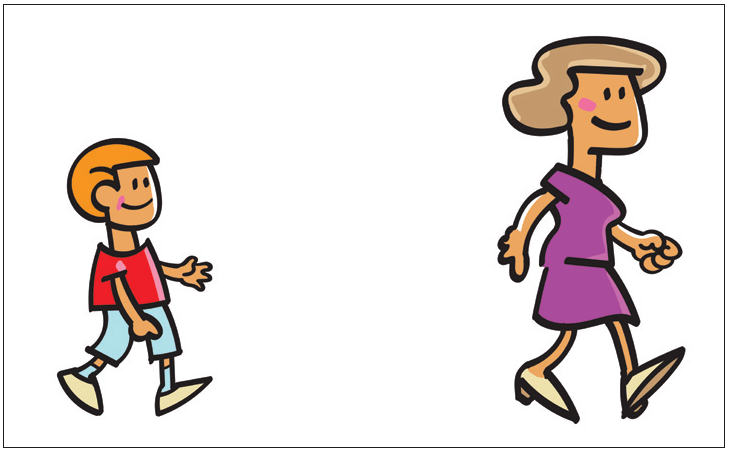

# 亲密性

新手的设计中，单词、短语和图片四处分布，连角落也不放过，占据了每一处空间，以至于根本没有任何留白。如果一个设计中充斥着太多的内容，这个页面会显得杂乱无章，读者也无法很快看到所需的信息。

亲密性原则是指：**将相关的项组织在一起，使它们物理位置相近，相关的项将被看作一体。**

如果某些信息项之间无关联，这些元素就不不应靠近。这样能为读者提供一个直观的提示，使读者了解页面的组织和内容。

下图：关于亲密性的例子：**物理位置的接近就意味着存在关联**（实际生活中也是如此）。

> *这样两个人，他们的关系并不明确。他们有关系吗？他们认识彼此吗？*

> *现在，这两个人之间存在关系。*
