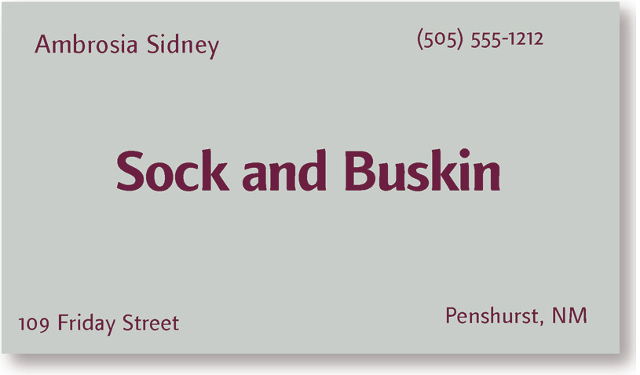
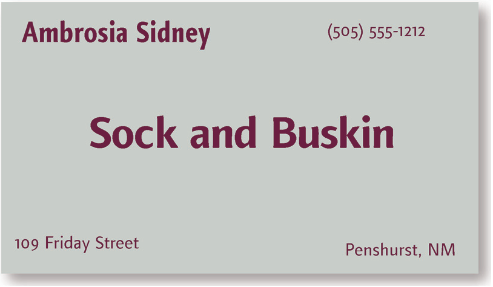
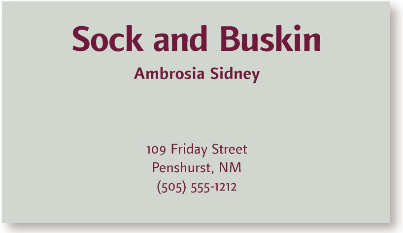

# 例子：名片

亲密性同样适用于设计，看看下面这张名片的布局(一种很典型的布局)。

* 在这样小的名片上有多少个单独的元素？
* 你的眼睛要移动多少次才能看到名片上的所有信息？

> - 5 次？因为名片上放置了 5 项孤立的内容。
> - 你从哪里开始看的？可能是中间，因为中间的短句字体最粗。
> - 接下来？按从左向右的顺序读？（因为这是英语。）
> - 已经完全读完名片（即名片右下角），你的目光又会移向哪里？是不是再巡视一番，确保自己没有遗漏任何角落？

---

再添点乱

> * 有两个元素都是粗体，你又该从哪开始看？左上角？还是中间？
> * 接下来看什么？也许你会在这些粗体词之间看来看去，找出角落里还隐藏着哪些词尚未看到。
> * 你知道什么时候才算完吗？

如果**多个项之间有很近的亲密性，它们就会成为一个视觉单元，而不再是孤立的元素**。就像实际生活中一样，亲密性意味着存在关联。

把类似的元素组织为一个单元，马上会带来很多变化。

1. 页面变得更有条理。
2. 你会清楚地知道从哪开始读信息，明白什么时候结束。
3. “空白”也会变得更有组织。

> 之前名片上每一项看上去都与其他任何项没有关联。这样一来，不清楚从哪里开始读名片，不知道何时才算结束。

对这张名片做一点调整——**把相关元素分在一组，使它们建立更近的亲密性**，看看会发生什么。

> 从哪开始读名片？接下来看什么？什么时候结束？这些问题现在还有疑问吗？

仅仅利用亲密性这样一个简单的概念，现在这张名片不论**从理解上**还是**从视觉上**都很有条理。而且还能更清楚地表达信息。

> *名片使用的字体为 Finnegan 的细体和粗体*
> 
> 
