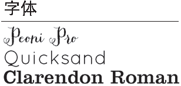

下面是一个简报刊头。这里有多少个单独元素？从放置位置看，能否看出某些信息项与其他项存在关联？

>  判断哪些项应当分在一组，建立更近的亲密性，而哪些应当分开。

> 右上角两项之间有很近的亲密性，意味着它们之间存在某种关系。不过这两项真的应该有某种关系吗？

下面的例子建立了正确的关系。

> 做了几个调整：
> * 把圆角变为直角，使刊头的外观更简洁、更突出
> * 把标题字号加大，使布局更合理
> * 把一些文字颜色调暗，这些字与其他字的对比度就没那么突兀了。

 训练你的设计师之眼：至少找到 3 个让第 2 个例子表意更清晰的不同之处。

