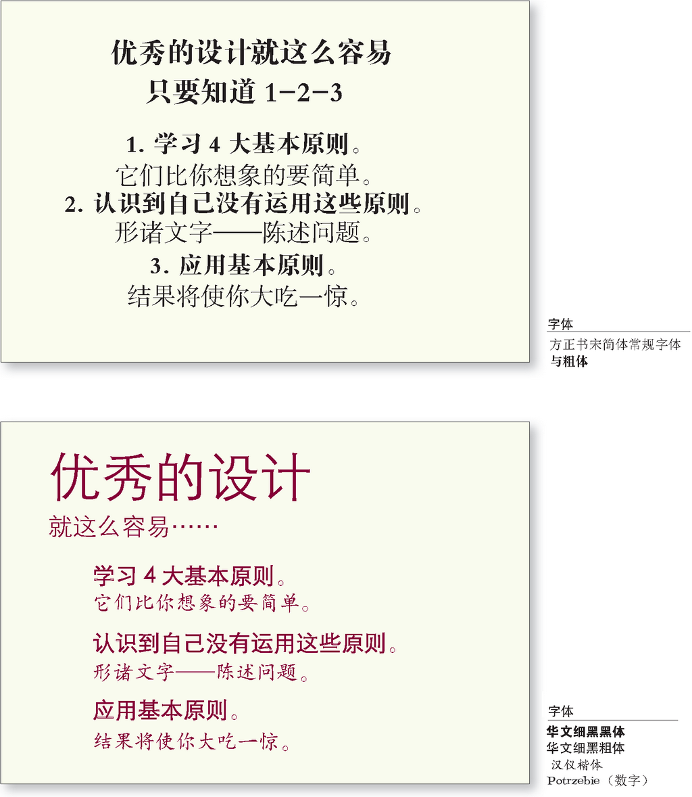
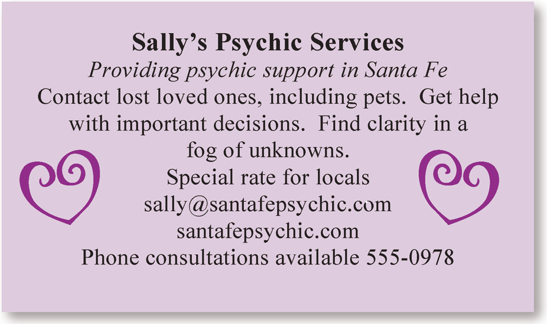
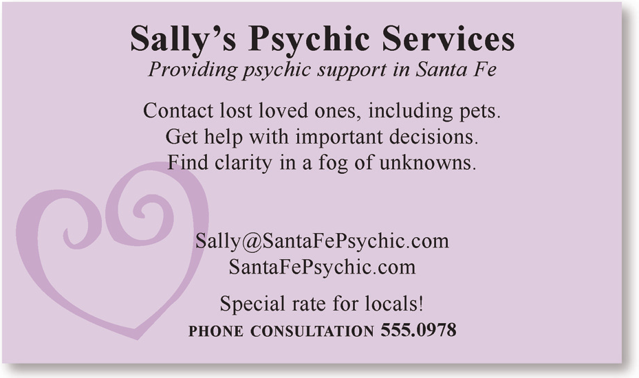
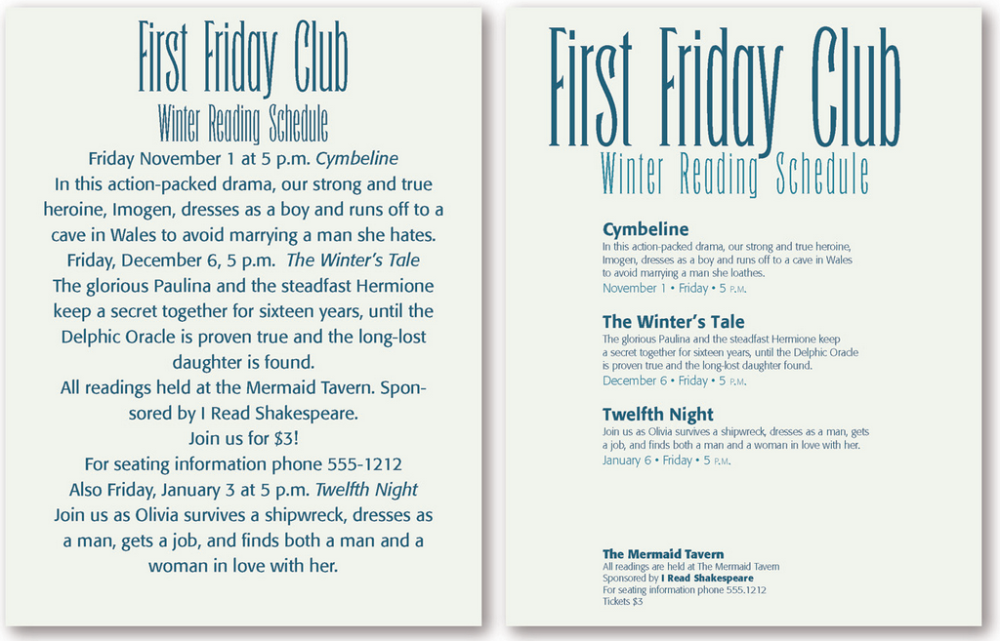
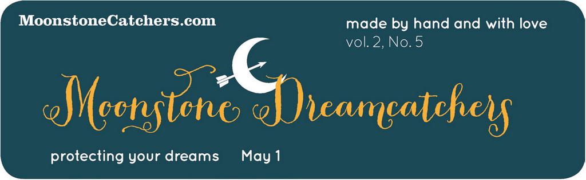
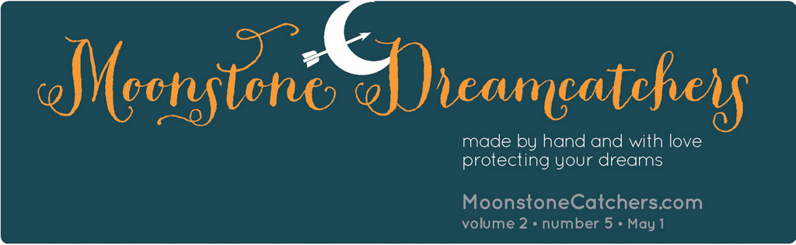
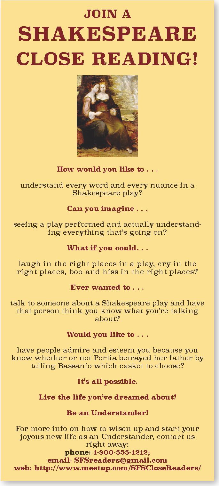
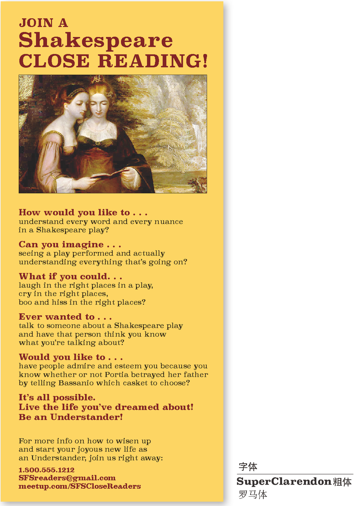

# 设计师字眼

## 1.0 设计原则

> **训练你的设计师之眼**：找到让第二个例子看起来表意更清晰的至少 5 处地方
> * 去掉了让边缘拥挤的边框
> * 使用了一种更明显的字体，这种字体需要足够粗，可以在页面上产生更强的效果（对比原则）
> * 重复使用了粗体来强调 3 个步骤，重复使用了细体字做注解（重复原则）
> * 文本有了清晰的对齐（对齐原则）
> * 3 个步骤分开了，所以你能马上认出它们，这样的话就没有必要使用数字编号了（亲密性原则）

## 2.3 明信片

**训练你的设计师之眼**：找到至少 8 个让第二个例子看起来更加专业的不同。

> * 标题更大
> * 其他部分的字更小。
> * 三种服务列在独立的三行
> * 把相关元素集中在一起。
> * 把邮箱和网址的字母大写，让它们更易读。
> * 去掉多余的心形。
> * 把心形变浅，不要让它和文字争夺注意力。
> * 把心形放大，让它和文本重叠融为一体。
> * 去掉 available 这个词

## 2.4 传单

训练你的设计师之眼：找到至少 5 个让第二个例子看起来更清晰、表达更流畅的地方

* 主体文字更小。
* 标题更大，当其余文本有条理而且更小的时候就能让标题更大。
* 信息有着一致的条理，这样读者就能找到想要的信息。
* 利用对比原则，标题加粗。
* 利用对齐原则实现了明确的对齐。

## 2.7 简报刊头

训练你的设计师之眼：至少找到 3 个让第 2 个例子表意更清晰的不同之处。

* 标题更大
* 边角没有那么圆了
* 文本对齐
* 缩写词拼出来
* 项目符号取代了逗号
* 文本变灰，可以更少地干扰视觉效果
* 月亮从上端逃出

## 2.8 传单

> **训练你的设计师之眼**：找到至少 5 个让这个例子表意更清晰的地方

- 联系信息在另外一行（但是归在一起并分隔开来），所以它会成为更加醒目的重要信息
- 删掉 phone、email、web 这些没有必要的词
- 删掉电话号码后面的分号，以及网址后最后一条斜线。
- 让页面的颜色更加明亮一些。
- 把 SHAKESPEARE 变成只有首字母大写，这样做会让这个词更易读而且可以被放得更大。
- 把照片裁剪得更宽。