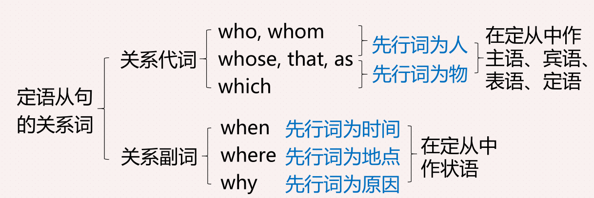

# 定语从句

* 定义从句在复合句中作定语（即**修饰名词或代词**）的句子。
* 结构：先行词(定语从句修饰的对象)+关系词(在定从中代替先行词)+定语从句

例子

* She is **the one(先行词)** **that(关系词)** you'll never forget. 她是你永远不会忘记的那个人
* She must be **the reason(先行词)** **why(关系词)** God made a girl. 她一定是上帝为何创造女孩的原因。

## 定语从句的关系词

定语从句的关系词在从句中一定作某一成分

1. 关系代词
    * She is *the one* **that** you'll never forget. that在定从中作宾语
    * I'm following *the map* **that** leads to you. 我追寻着那张通向你的地图。 that在定从中作主语
2. 关系副词
    * She must be *the reason* **why** God made a girl. 在定从中作原因状语
    * Crush through *the surface* **where** they can't hurt us. 拥挤到那别人无法伤害我们的表面之下。where 在定从中作地点状语

## 定语从句的关系词 that & which

that与which的区别（二者都可以指代物）

### 只用that， 不能用 which

1. 先行词同时有人和物
   * Please talk about *the city and people* that you have visited. 请聊一聊你参观的城市和人们。
2. 先行词被序数词修饰
   * This is the first time that I’ve been there. 这是我第一次来这里。
3. 先行词被形容词最高级修饰
   * Bangkok is the hottest city that I’ve ever been to. 曼谷是我去过的最热的城市。
4. 先行词是不定代词
   * Please do something that could help. 请做些什么来帮忙。
5. 先行词被the only, the very等表特指的词修饰
   * I'm the only one that was late this morning. 我是今早唯一迟到的人

### 只用which， 不能用that

1. 关系词前有介词。(介词＋which)
2. 在非限定性定语从句中。

## 介词+关系代词which（物）/whom（人）

如何判断用什么介词? **介词+which有时可用关系副词替换**

1. 根据介词与先行词的搭配关系判断
   * I’ll never forget the day on which we first met. `=when we first met`
2. 根据定语从句中动词与介词的搭配关系判断。
   * This is the house in which we lived last year. `=where we live last year`
3. 根据定语从句的句意判断
   * This is my pair of glasses, without which I cannot see clearly.

## 限定性定语从句&非限定性定语从句

* 非限定性定语从句删除后，句意仍然完整；限定性定语从句删除后，句意不完整。
* 常用逗号将非限定性定语从句与主句隔开。

1. 限定性定语从句
   * This is the shopping mall that/which opened last month. 这是上个月开业的那个商场
2. 非限定性定语从句
   * This shopping mall attracts customers all over the city, which brings it large amount of income. 这家商场吸引了全城的消费者，这为其带来了巨大的收益。
   * 非限定性定语从句的**先行词可以是整个主句**。

## 定语从句的关系词 as

关系代词as的用法

1. 限定性定语从句

    **先行词被such/so/the same修饰时，定语从句用as(作主语、表语、宾语)引导**

    * He is not such a man as I thought he was. 他并非我所想的那样的人.
    
2. 非限定性定语从句
   
   **先行词为句子时，定语从句可用as(作主语、表语、宾语)引导。**

    * As we all know, China is a developing country. 
   
   **当非限定性定语从句在主句之前时，关系词只能用as，不能用which。**

## 定语从句关系词的省略

TODO

定语从句的关系代词that/which/who/whom，在某些情况下可以省略。
